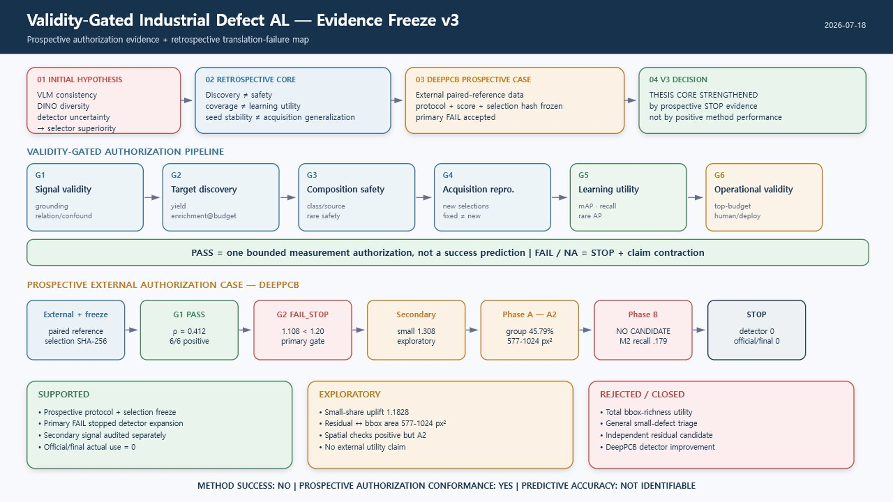
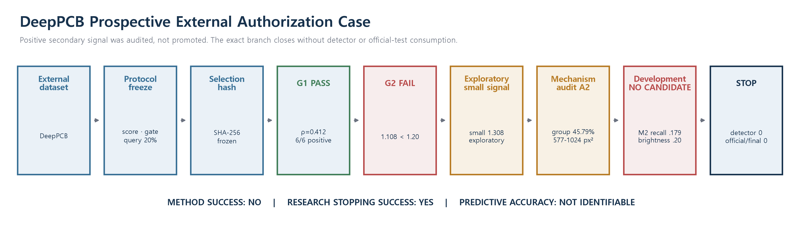

# Validity-Gated Evaluation for Industrial Defect Active Learning

This repository contains a year-long empirical study of candidate acquisition
signals for industrial-defect active learning (AL). The project began with a
VLM explanation-consistency selector hypothesis and expanded to DINO diversity,
detector uncertainty, discovery/safety audits, and downstream object-detector
validation.

The frozen thesis contribution is **not** a universally superior selector. It is
a validity-gated empirical evaluation and cost-containment workflow that separates:

1. signal validity,
2. target discovery,
3. composition safety,
4. acquisition-set reproducibility,
5. downstream learning utility, and
6. operational validity.

Current evidence freeze: **2026-07-18, v3**

Synthesis decision: **A. THESIS_CORE_STRENGTHENED_BY_PROSPECTIVE_STOP**

This decision means that the thesis core gained a prospective authorization/STOP
case. It does **not** mean that DeepPCB produced a successful selector, that the
workflow predicts future detector success, or that the original selector-superiority
hypothesis was recovered.



Editable full-screen versions: [HTML](docs/figures/full_page_validity_gated_architecture_v2.html),
[SVG](docs/figures/full_page_validity_gated_architecture_v2.svg), and
[PDF](docs/figures/full_page_validity_gated_architecture_v2.pdf).

## Frozen research conclusions

### Supported

- Candidate-signal discovery, composition safety, and detector learning utility
  are distinct endpoints.
- A fixed selected set being stable across training seeds does not establish
  acquisition-set generalization.
- Random is a strong baseline in balanced industrial-defect pools because it can
  naturally preserve class coverage, instance diversity, and bbox richness.
- GC10, MPDD, and VisA showed real discovery gains under some selectors, but the
  gains were accompanied by dataset-specific category/source/safety risks.
- The DeepPCB protocol, score, gate, query fraction, eligible groups, and selection
  hash were frozen before post-hoc GT audit.
- DeepPCB's primary failure stopped detector expansion; detector training/inference
  and official/final-test use remained zero.
- At least 45 explicitly planned detector model runs were not executed in earlier
  documented branches. No undocumented counterfactual count is added for DeepPCB.

### Exploratory only

- DeepPCB small-bbox enrichment: `1.307591`.
- DeepPCB small-share uplift: `1.182816`, 95% CI `[1.081407, 1.371080]`.
- The main enriched bbox-area range was `577-1024 px²`.
- Detector FN/rare-FN enrichment and dataset-specific discovery mechanisms remain
  post-hoc or development-only signals.

### Rejected or closed

- VLM explanation consistency as a direct proxy for epistemic uncertainty.
- Stable VLM-consistency or global-DINO selector superiority over Random.
- Global DINO coverage as a guarantee of detector learning utility.
- General small-defect triage from the DeepPCB secondary signal.
- An independent reference-residual candidate on DeepPCB.
- Any claim of DeepPCB detector improvement.

### Not identifiable from the present evidence

- Prospective predictive accuracy of a generic stopping policy.
- Independent production-lot/time/source generalization.
- Counterfactual outcomes of branches stopped before downstream training.
- Monetary annotation savings, inspector trust, or field acceptance.

The precise boundaries are frozen in
[`docs/thesis_claim_boundary_v3_20260718.md`](docs/thesis_claim_boundary_v3_20260718.md).

## DeepPCB prospective external authorization case

The final external branch followed this frozen path:

```text
External dataset
  -> protocol + score + query fraction freeze
  -> selection SHA-256 freeze
  -> G1 relation PASS (mean Spearman 0.412174; 6/6 positive)
  -> G2 primary FAIL_STOP (total bbox enrichment 1.107693 < 1.20)
  -> exploratory small signal (1.307591)
  -> Phase A A2_MECHANISM_AMBIGUOUS
       - dominant group contribution 45.79%
       - main enriched range 577-1024 px²
  -> development benchmark NO_CANDIDATE
       - best M2 small recall 0.179
       - FP/image 0.973
       - brightness retention 0.20
  -> STOP
       - external confirmation not authorized
       - detector screen not authorized
       - detector training/inference 0
       - official/final-test actual use 0
```



The branch is closed. Score/threshold rescue, additional DeepPCB candidate search,
detector training/inference, and official-test access are prohibited under Evidence
Freeze v3.

## Primary deliverables

- [Research evolution and Evidence Freeze v3](docs/research_evolution_and_evidence_freeze_v3_20260718.md)
- [Mini paper source](docs/mini_paper_validity_gated_industrial_al_v2_20260718.md)
- [Mini paper DOCX](docs/mini_paper_validity_gated_industrial_al_v2_20260718.docx)
- [Mini paper PDF](docs/mini_paper_validity_gated_industrial_al_v2_20260718.pdf)
- [Advisor decision brief](docs/advisor_decision_brief_deeppcb_closure_20260718.md)
- [DeepPCB branch closure](docs/deeppcb_branch_closure_20260718.md)
- [Thesis defense non-regression contract](docs/thesis_defense_readiness_v3_20260718.md)
- [Hypothesis transition matrix v3](docs/hypothesis_transition_matrix_v3_20260718.csv)
- [Acquisition mechanism matrix v3](docs/acquisition_mechanism_matrix_v3_20260718.csv)
- [Frozen research evidence ledger](runs/evidence_freeze_v3_20260718/research_evidence_ledger.csv)

Earlier reports remain in `docs/` as an audit trail. The v3 files above are the
current entry points and take precedence over older optimistic descriptions.

## Repository layout

```text
Defect_VLM_Project/
├─ README.md
├─ docs/
│  ├─ figures/                  # paper and architecture figures
│  ├─ results/                  # curated historical summaries
│  ├─ *_v3_20260718.*           # current freeze and claim-boundary artifacts
│  └─ earlier protocols/reports # chronological audit trail
├─ scripts/
│  ├─ 01_preprocessing/
│  ├─ 01_score_generation/
│  ├─ 02_active_learning/
│  ├─ 03_analysis/
│  ├─ 04_dcal_xai/              # validity-gated integration and paper builders
│  └─ 05_deeppcb_prospective/   # frozen DeepPCB prospective branch and v3 builder
├─ tests/
└─ runs/evidence_freeze_v3_20260718/
   ├─ research_evidence_ledger.csv
   ├─ source_registry.csv
   └─ freeze_config.json
```

## Clone and resume on Windows or macOS

The repository tracks source code, protocols, curated evidence, figures, and paper
artifacts. It intentionally does not track benchmark datasets, model weights,
virtual environments, raw training outputs, or temporary renders.

```bash
git clone https://github.com/hoyeol-ui/Defect_VLM_Project.git
cd Defect_VLM_Project
git switch codex/evidence-freeze-v3
```

Create a local Python 3.11 environment.

macOS/Linux:

```bash
python3.11 -m venv .venv
source .venv/bin/activate
python -m pip install --upgrade pip
python -m pip install -r requirements-analysis.txt
```

Windows PowerShell:

```powershell
py -3.11 -m venv .venv
.\.venv\Scripts\Activate.ps1
python -m pip install --upgrade pip
python -m pip install -r requirements-analysis.txt
```

Install only the dependencies required by the branch you intend to reproduce.
The analysis/freeze scripts use common packages including NumPy, pandas, SciPy,
scikit-learn, Pillow, matplotlib, OpenCV, PyYAML, and tqdm. Detector/VLM branches
add PyTorch, Ultralytics, Transformers, sentence-transformers, and model-specific
dependencies. CUDA-specific packages should be installed separately on the target
machine; do not copy the Windows `.venv` to macOS.

Local assets expected by historical scripts are ignored by Git:

```text
data/       benchmark datasets and annotations
models/     local model files
weights/    detector/VLM weights
runs/       raw experiment outputs, except the compact v3 evidence package
tmp/        local render and audit scratch space
```

See [`docs/macbook_handoff_guide_20260712.md`](docs/macbook_handoff_guide_20260712.md)
and [`docs/research_context_handoff_20260712.md`](docs/research_context_handoff_20260712.md)
for the earlier machine-transfer notes.

## Reproduce the frozen v3 integration

These commands do not train a detector, run VLM inference, or access an official
test split. They rebuild/read-check the frozen integration from existing local
source artifacts.

Windows:

```powershell
.\.venv\Scripts\python.exe scripts\05_deeppcb_prospective\build_evidence_freeze_v3.py --dry-run
.\.venv\Scripts\python.exe scripts\05_deeppcb_prospective\test_evidence_freeze_v3.py
```

macOS/Linux:

```bash
python scripts/05_deeppcb_prospective/build_evidence_freeze_v3.py --dry-run
python scripts/05_deeppcb_prospective/test_evidence_freeze_v3.py
```

The integrity test verifies the original `FAIL_STOP`, Phase A
`A2_MECHANISM_AMBIGUOUS`, Phase B `NO_CANDIDATE`, authorization locks, exploratory
status of the small signal, 577-1024 px² interpretation, 45.79% group dominance,
source locators, and zero detector/official-test use.

`build_evidence_freeze_v3.py` requires the original local frozen run artifacts for
a full rebuild. A fresh Git clone still contains the final paper, figures, matrices,
and compact evidence package for reading and editing, but it does not contain raw
datasets or historical run directories.

## Safe continuation rules

Before adding a new experiment:

1. Define the research question and inferential unit.
2. Freeze the pool/split, score, query budget, seed policy, gate, and stopping rule.
3. Keep official/final data locked until explicitly authorized.
4. Treat a PASS as permission for one bounded downstream measurement, not as a
   prediction of success.
5. Record positive endpoints and composition/safety failures together.
6. Keep new work separate from the closed DeepPCB reference-residual branch.
7. Update the evidence ledger and claim boundary before expanding conclusions.

## Citation and research status

This repository is an active thesis artifact, not a released production AL system.
When citing results, use the source locators in the v3 evidence ledger and preserve
the supported/exploratory/rejected/not-identifiable distinctions.

The central frozen question is:

> How can an industrial-defect AL study prevent an insufficient positive candidate
> signal from being promoted into an unsupported detector-success claim?
