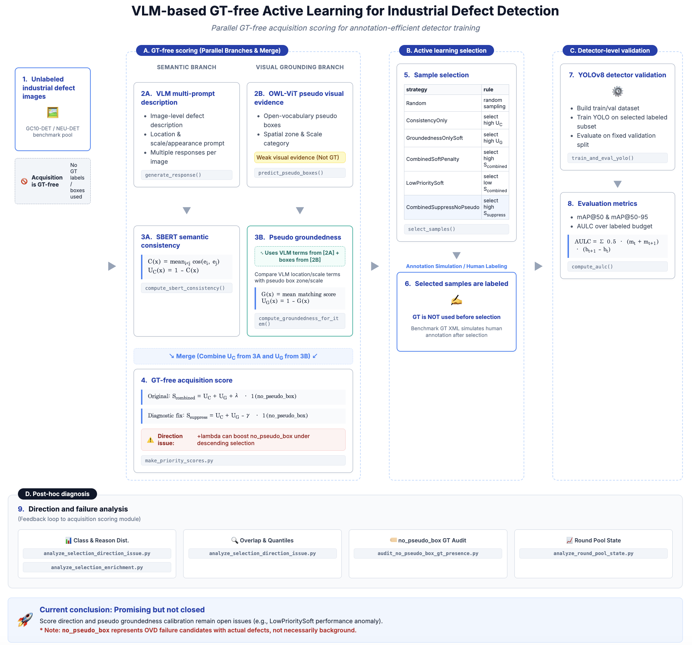

# Expert Prompt Consistency-driven GT-free Active Learning for Industrial Defect Detection

This repository studies **GT-free active learning for industrial defect detection** driven by an **expert-designed VLM prompt family**.
The central question is:

> Can inconsistency among VLM explanations generated from an expert-designed industrial-defect prompt family identify informative unlabeled images for annotation before any ground-truth labels or boxes are used?

The project does **not** use ground-truth annotations during acquisition scoring.
Ground-truth XML annotations from benchmark datasets are used only **after sample selection** to simulate human annotation and to validate the selected samples through YOLOv8 detector training.

Core novelty:

- expert-designed prompt family for industrial defect description,
- semantic consistency uncertainty from multi-prompt VLM responses,
- GT-free active learning acquisition.

Auxiliary extension:

- pseudo groundedness from OWL-ViT weak visual evidence.

Failure analysis:

- `no_pseudo_box` direction/calibration issue,
- `LowPrioritySoft` reverse-direction control,
- `CombinedSuppressNoPseudo` calibration.

## Overview



Figure. Overall workflow of the VLM-based GT-free active learning pipeline. Ground-truth annotations are not used during acquisition scoring; benchmark XML labels are used only after sample selection to simulate human annotation and validate YOLO detector performance. The editable HTML source for this figure is available at [`docs/vlm_gt_free_al_workflow.html`](docs/vlm_gt_free_al_workflow.html).

## Research Motivation

Industrial defect detection often requires bounding-box annotation, which is expensive and slow. Conventional active learning methods typically depend on a detector model that has already been trained with some labeled data. This project explores a different setting:

- the image pool is initially treated as unlabeled,
- VLM explanations are used as a semantic uncertainty signal,
- OWL-ViT pseudo boxes are used as weak visual evidence,
- acquisition scores are computed without GT labels or GT boxes,
- selected samples are then treated as annotated and evaluated by detector training.

The goal is not to prove that the current scoring rule is already optimal. The current conclusion is:

> The framework is promising but not closed. Useful acquisition signals exist, but score direction and pseudo-groundedness calibration remain open issues.

## End-to-End Workflow

### 1. Unlabeled Industrial Defect Pool

The input pool consists of industrial defect images, currently from benchmark datasets such as **GC10-DET** and **NEU-DET**. During acquisition, the code treats these images as unlabeled.

Important distinction:

- **Acquisition scoring:** no GT labels, no GT boxes.
- **Post-selection simulation:** benchmark GT XML files simulate human annotation.
- **Evaluation:** YOLOv8 is trained and evaluated using the selected labeled subset and a fixed validation split.

### 2. VLM Multi-prompt Description

For each image, a VLM generates multiple descriptions using an expert-inspired prompt family for industrial defect inspection. The current version is `expert_defect_v1`, with location, scale, and appearance prompts.

Main code lineage:

- `scripts/01_score_generation/prompt_families.py`
- `EXPERT_DEFECT_PROMPT_FAMILY`
- `get_prompt_family()`
- `compute_prompt_family_hash()`
- `scripts/old/260511_VLM_ActiveLearning_FullExperiment.py`
- `generate_response()`
- `run_prompt_group_experiment()`
- `scripts/grounded_prompt_experiment.py`

Although this code currently lives under `scripts/old/`, it is the source of the VLM multi-prompt consistency experiments used by the current pipeline.
The compatibility script `scripts/grounded_prompt_experiment.py` is treated as prompt-family pilot validation; it may use benchmark GT for audit, but GT is not used in downstream active learning acquisition.

### 3. Semantic Consistency

The generated VLM responses are embedded using SBERT. Pairwise cosine similarities between response embeddings are averaged to estimate semantic consistency.

```text
C(x) = [2 / (K * (K - 1))] * sum_{i<j} cos(e_i, e_j)
```

```text
U_C(x) = 1 - C(x)
```

Interpretation:

- high `C(x)`: VLM descriptions are semantically stable,
- low `C(x)`: VLM descriptions are inconsistent,
- high `U_C(x)`: high semantic uncertainty and potentially informative acquisition candidate.

Main code:

- `compute_sbert_consistency()`
- `cosine_similarity()`

### 4. OWL-ViT Pseudo Visual Evidence

In parallel with VLM description generation, OWL-ViT predicts open-vocabulary pseudo boxes. These boxes are not treated as ground truth. They are only weak GT-free visual evidence.

Main code:

- `scripts/01_score_generation/run_ovd_pseudo_boxes.py`
- `collect_candidate_images()`
- `load_ovd_model()`
- `predict_pseudo_boxes()`

### 5. Pseudo Groundedness

Pseudo groundedness compares VLM-extracted location/scale terms with OWL-ViT pseudo-box spatial zones and scale categories.

```text
G(x) = [1 / |D|] * sum_{d in D} s_d
```

```text
U_G(x) = 1 - G(x)
```

Here, `D` denotes comparable dimensions such as location and scale, and `s_d` denotes the matching score for each dimension.

Main code:

- `scripts/01_score_generation/compute_pseudo_groundedness.py`
- `choose_best_pseudo_box()`
- `compute_groundedness_for_item()`
- `determine_reason()`

Groundedness reason categories include:

- `matched`
- `partial_match`
- `location_mismatch`
- `no_pseudo_box`

Important note: `no_pseudo_box` does not necessarily mean background or non-defect. Post-hoc audits show that it can indicate OWL-ViT failure candidates where GT defects exist but the pseudo detector failed to produce a box.

### 6. GT-free Acquisition Score

The original combined score uses semantic uncertainty and pseudo-groundedness uncertainty:

```text
S_combined(x) = U_C(x) + U_G(x) + lambda * I(no_pseudo_box)
```

The current diagnostic variant suppresses excessive `no_pseudo_box` priority:

```text
S_suppress(x) = U_C(x) + U_G(x) - gamma * I(no_pseudo_box)
```

Main code:

- `scripts/01_score_generation/make_priority_scores.py`
- `compute_priority_score()`
- `get_effective_groundedness()`
- `make_row()`
- `scripts/02_active_learning/run_al_yolo_ablation_v3_minimal.py`
- `prepare_priority_dataframe()`

Key implementation finding:

> Because high-priority selection sorts scores in descending order, adding `+lambda` for `no_pseudo_box` can behave as a boost rather than a penalty.

This is one of the main score-direction issues diagnosed in the current experiments.

## Acquisition Strategies

The current active learning experiments compare the following strategies:

| Strategy ID | Research display name | Score used | Selection rule | Purpose |
|---|---|---|---|---|
| `Random` | Random | none | random sampling | baseline |
| `ConsistencyOnly` | ExpertPromptConsistency | `U_C` | select high score | core hypothesis: expert prompt-family consistency |
| `GroundednessOnlySoft` | PseudoGroundingOnly | `U_G` with soft missing handling | select high score | auxiliary-only ablation |
| `CombinedSoftPenalty` | Consistency + AuxGrounding | `S_combined` | select high score | naive auxiliary extension |
| `LowPrioritySoft` | ReverseDirectionControl | `S_combined` | select low score | direction-control strategy |
| `CombinedSuppressNoPseudo` | Calibrated Consistency + AuxGrounding | `S_suppress` | select high score | no-pseudo calibration diagnostic |
| `CombinedSuppressNoPseudoClassBalanced` | Class-balanced Calibrated AuxGrounding | `S_suppress` with class-balanced selection | select high score within class quota | diagnostic class-balance variant |

Main code:

- `scripts/02_active_learning/run_al_yolo_ablation_v3_minimal.py`
- `scripts/02_active_learning/strategy_metadata.py`
- `select_samples()`
- `sort_select()`
- `class_balanced_select()`

## Detector-level Validation

After samples are selected, the benchmark GT XML annotations are used to simulate human labeling. YOLOv8 is trained on the selected labeled subset and evaluated on a fixed validation split.

Main code:

- `scripts/02_active_learning/run_al_yolo_ablation_v3_minimal.py`
- `make_fixed_val_split()`
- `build_yolo_dataset()`
- `train_and_eval_yolo()`

Evaluation metrics:

- `mAP@50`
- `mAP@50-95`
- AULC over labeled budget

```text
AULC = sum_{t=1}^{T-1} 0.5 * (m_t + m_{t+1}) * (b_{t+1} - b_t)
```

Main summary code:

- `compute_aulc()`
- `make_seed_strategy_summary()`
- `make_aggregate_strategy_summary()`

## Post-hoc Diagnosis

The current work includes post-hoc analysis scripts to diagnose whether the acquisition scores behave as intended.

| Analysis | Main script | Purpose |
|---|---|---|
| Selection direction issue | `scripts/03_analysis/analyze_selection_direction_issue.py` | compare strategy distributions, overlap, quantiles, and mAP trends |
| Selection enrichment | `scripts/03_analysis/analyze_selection_enrichment.py` | compare selected samples against the full priority pool |
| No-pseudo GT audit | `scripts/03_analysis/audit_no_pseudo_box_gt_presence.py` | check whether `no_pseudo_box` selected samples contain GT defects |
| Round pool state | `scripts/03_analysis/analyze_round_pool_state.py` | track selected vs remaining pool behavior by round |
| Consistency hypothesis | `scripts/03_analysis/analyze_consistency_hypothesis.py` | reframe results around the core prompt-family consistency hypothesis |
| Recovered result summaries | `scripts/03_analysis/recover_v3_minimal_results.py` | recover and summarize runs if training completed but final aggregation failed |

Important diagnostic findings so far:

- `CombinedSoftPenalty` can outperform `Random` in some budget ranges or AULC settings, suggesting that the acquisition signal is not meaningless.
- `LowPrioritySoft` performing strongly in some runs indicates that the high-priority direction is not yet fully validated.
- `no_pseudo_box` can reflect OWL-ViT pseudo-box failure candidates rather than background-only images.
- The sign and calibration of `no_pseudo_box` handling materially affect selected sample composition.
- `CombinedSuppressNoPseudo` reduces `no_pseudo_box` selection compared with `CombinedSoftPenalty`, but later rounds can still become dominated by `no_pseudo_box` due to remaining-pool composition.

## Current 8-seed Result Snapshot

The following table summarizes the latest lightweight result sets used for lab-meeting discussion.
Raw training folders remain ignored; curated result summaries can be stored under `docs/results/`.

| Result set | Strategy | Research role | Final mAP@50 | Final mAP@50-95 | AULC@50 | AULC@50-95 |
|---|---|---|---:|---:|---:|---:|
| 20260706 auxiliary calibration | `Random` | detector-level reference baseline | 0.348 | 0.172 | 6.264 | 2.857 |
| 20260706 auxiliary calibration | `CombinedSoftPenalty` | naive consistency + auxiliary groundedness | 0.295 | 0.139 | 5.618 | 2.627 |
| 20260706 auxiliary calibration | `CombinedSuppressNoPseudo` | calibrated no-pseudo diagnostic variant | 0.264 | 0.131 | 5.855 | 2.850 |
| 20260707 consistency core | `ConsistencyOnly` | core expert-prompt consistency hypothesis | 0.294 | 0.148 | 5.901 | 2.822 |
| 20260707 consistency core | `GroundednessOnlySoft` | auxiliary pseudo-groundedness-only ablation | 0.155 | 0.076 | 5.340 | 2.415 |
| 20260707 consistency core | `LowPrioritySoft` | reverse-direction control | 0.315 | 0.144 | 7.339 | 3.325 |

Current interpretation:

- `Random` remains a strong detector-level reference and should not be presented as defeated.
- `ConsistencyOnly` is much stronger than `GroundednessOnlySoft`, supporting the claim that expert prompt-family consistency is the more meaningful core signal.
- `CombinedSoftPenalty` and `CombinedSuppressNoPseudo` do not clearly improve over `ConsistencyOnly`, so pseudo groundedness should be framed as weak auxiliary evidence rather than the main contribution.
- `LowPrioritySoft` still performs strongly in AULC, which means score direction and calibration remain open.
- The defensible conclusion is: promising but not closed.

## Main Repository Structure

```text
scripts/
  01_score_generation/
    prompt_families.py
    run_ovd_pseudo_boxes.py
    compute_pseudo_groundedness.py
    make_priority_scores.py
    make_priority_scores_sensitivity.py

  02_active_learning/
    strategy_metadata.py
    run_al_yolo_ablation_v3_minimal.py
    run_al_yolo_ablation_v4_direction_fix.py
    run_yolo_full_supervised_baseline.py

  03_analysis/
    analyze_consistency_hypothesis.py
    analyze_selection_direction_issue.py
    analyze_selection_enrichment.py
    analyze_round_pool_state.py
    audit_no_pseudo_box_gt_presence.py
    recover_v3_minimal_results.py

  00_prompt_validation/
    validate_expert_prompt_family_with_gt.py

  old/
    260511_VLM_ActiveLearning_FullExperiment.py
```

## Typical Commands

Generate priority-score sensitivity variants:

```bash
.venv/bin/python scripts/01_score_generation/make_priority_scores_sensitivity.py \
  --priority-csv outputs/pseudo_boxes_20260622_191121/priority_scores_pseudo.csv \
  --penalties 0,0.1,0.2,0.5 \
  --groundedness-weights 0,0.25,0.5,1.0
```

Run a dry-run selection check without YOLO training:

```bash
AL_DRY_RUN_ONLY=1 \
AL_PRIORITY_CSV=outputs/priority_sensitivity_20260706_152020/penalty_0/priority_scores_pseudo.csv \
AL_STRATEGIES=Random,CombinedSoftPenalty,CombinedSuppressNoPseudo \
AL_SEEDS=42,43,44 \
AL_SUPPRESS_NO_PSEUDO_GAMMA=0.1 \
.venv/bin/python scripts/02_active_learning/run_al_yolo_ablation_v3_minimal.py
```

Run detector-level validation:

```bash
AL_PRIORITY_CSV=outputs/priority_sensitivity_20260706_152020/penalty_0/priority_scores_pseudo.csv \
AL_STRATEGIES=Random,CombinedSoftPenalty,CombinedSuppressNoPseudo \
AL_SEEDS=42,43,44 \
AL_SUPPRESS_NO_PSEUDO_GAMMA=0.1 \
.venv/bin/python scripts/02_active_learning/run_al_yolo_ablation_v3_minimal.py
```

Run direction-issue analysis:

```bash
.venv/bin/python scripts/03_analysis/analyze_selection_direction_issue.py \
  --run-dir runs/active_learning_ablation_v3_minimal/<RUN_DIR> \
  --priority-dir outputs/pseudo_boxes_20260622_191121
```

Run consistency-hypothesis analysis:

```bash
.venv/bin/python scripts/03_analysis/analyze_consistency_hypothesis.py \
  --run-dir runs/active_learning_ablation_v3_minimal/<RUN_DIR>
```

## Current Status

Implemented:

- expert prompt family versioning for VLM industrial defect descriptions
- VLM explanation consistency scoring
- OWL-ViT pseudo-box generation
- pseudo groundedness computation
- GT-free priority score generation
- multiple active learning acquisition strategies
- YOLOv8 detector-level validation
- mAP/AULC aggregation
- direction-issue and no-pseudo diagnostics

Open research issues:

- score-direction calibration,
- pseudo-groundedness reliability,
- `no_pseudo_box` handling,
- class and dataset distribution shifts,
- seed and validation split sensitivity,
- stronger evidence before claiming superiority over random selection.

## Research Position

This repository should be read as an experimental research framework, not as a closed final method. The current evidence supports the following careful claim:

> VLM consistency and pseudo-groundedness provide useful GT-free acquisition signals, but the acquisition direction and weak visual evidence calibration require further validation before claiming robust superiority.

More precisely, the core hypothesis is:

> Expert-designed VLM prompt-family inconsistency can serve as a GT-free active learning acquisition signal. Pseudo groundedness is weak auxiliary visual evidence, not the core method or ground-truth localization.
