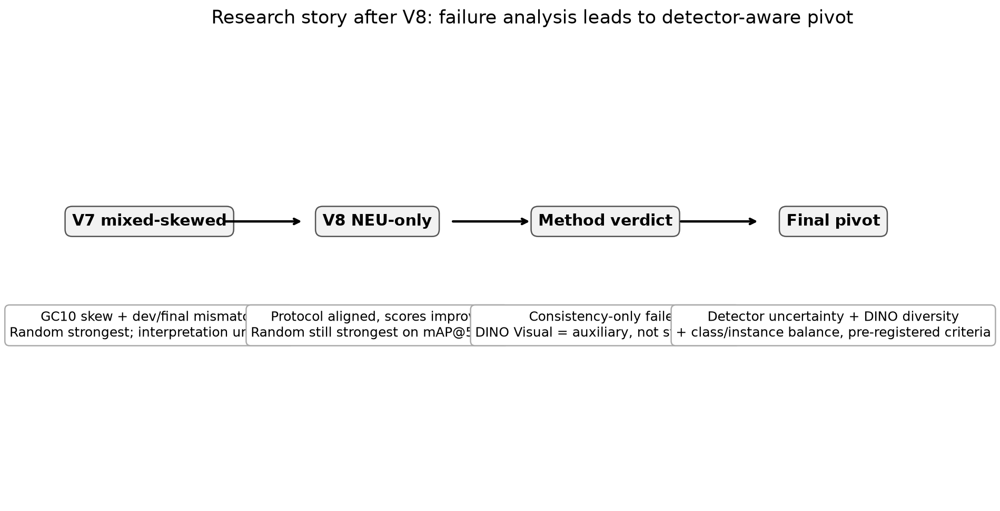
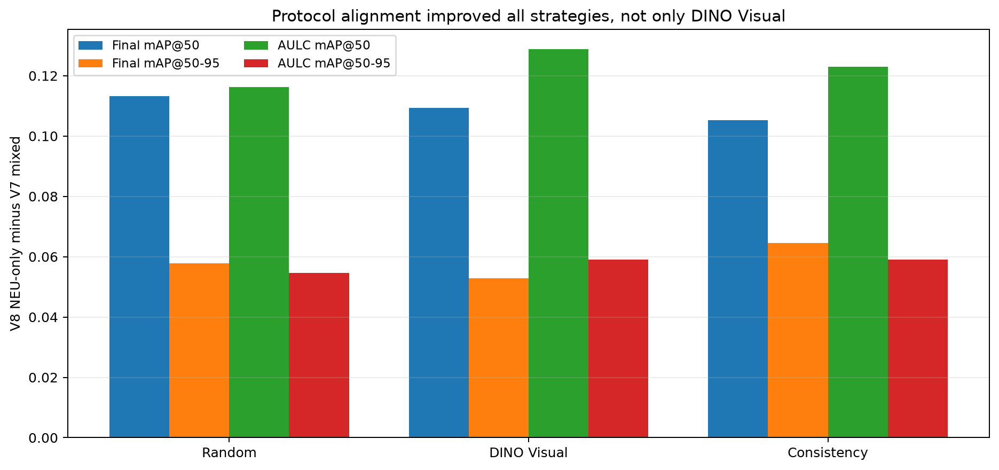
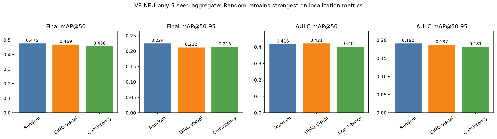
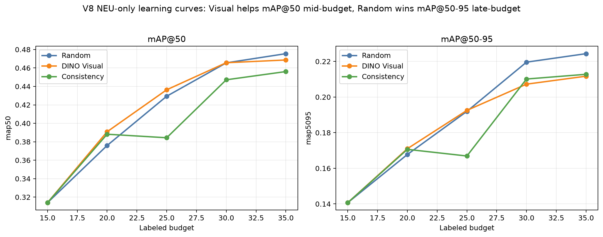
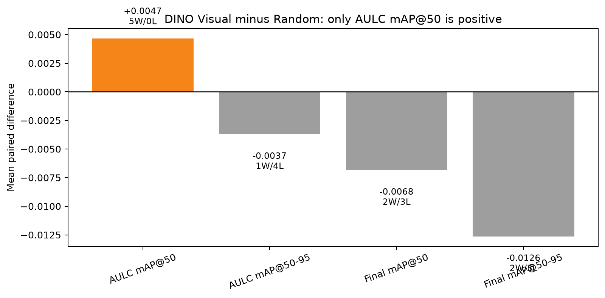
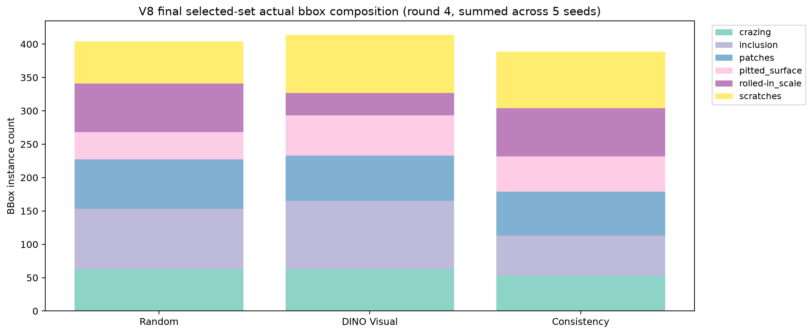

# 최신 분석 시각화 패키지

최종 업데이트: 2026-07-12

이 폴더는 현재까지 완료된 V7/V8 결과를 “성공처럼 포장”하기보다, 무엇이 실제로 확인됐고 무엇이 실패했는지 시각적으로 정리하기 위해 만들었다.

## 핵심 판정

현재까지의 실험만으로는 `DINO Visual`을 Random보다 우수한 독립 Active Learning 전략이라고 주장할 수 없다.

가장 방어 가능한 결론은 다음이다.

> Consistency-only는 실패했다. DINO Visual은 consistency보다 나았지만, Random 대비 이점은 mAP@50 AULC의 작은 개선에 한정되었고 localization-sensitive 지표에서는 열세였다. 따라서 DINO Visual은 독립 acquisition strategy가 아니라 detector-aware uncertainty/balance와 결합될 보조 신호로 보는 것이 타당하다.

## V8 NEU-only 5-seed 결과 요약

| Strategy | Final mAP@50 | Final mAP@50-95 | AULC mAP@50 | AULC mAP@50-95 |
|---|---:|---:|---:|---:|
| Random | 0.475493 | 0.224357 | 0.416392 | 0.190456 |
| DINO Visual | 0.468646 | 0.211717 | 0.421051 | 0.186739 |
| Consistency | 0.456095 | 0.212775 | 0.401187 | 0.181097 |

`DINO Visual`은 `Consistency`보다 label-efficiency 관점에서 명확히 나았지만, `Random`을 안정적으로 넘지는 못했다.

## 그림 목록과 해석

### 1. 연구 스토리 판정 흐름

실험 흐름의 핵심 메시지를 한 장으로 요약한 그림이다. 발표 도입부나 결과 해석 섹션에 쓰기 좋다.

### 2. V7 mixed에서 V8 NEU-only로 넘어갈 때의 성능 변화

NEU-only로 protocol을 정리하자 모든 전략의 성능이 크게 상승했다. 이는 V7 mixed의 낮은 성능이 acquisition 전략만의 문제가 아니라 GC10 skew, mixed-domain protocol, eval 구성 차이의 영향을 받았다는 해석을 뒷받침한다.

### 3. V8 NEU-only aggregate metric 비교

최종 성능과 AULC를 전략별로 비교한 핵심 그림이다. Random이 최종 mAP와 localization-sensitive 지표에서 강하게 남아 있음을 보여준다.

### 4. V8 NEU-only learning curves

라벨 예산 15→20→25→30→35장으로 증가할 때의 평균 learning curve다. DINO Visual은 mAP@50 AULC에서 Random보다 약간 앞서지만, mAP@50-95에서는 Random을 넘지 못한다.

### 5. Visual minus Random paired deltas

acquisition seed별로 DINO Visual이 Random 대비 얼마나 이겼거나 졌는지 보여준다. `AULC mAP@50`에서는 전 seed에서 양수지만, 더 엄격한 localization metric에서는 안정적인 우위가 없다.

### 6. 최종 35장 class/instance composition

선택된 최종 라벨 세트의 class/instance 구성 비교용 그림이다. Random baseline이 강한 이유가 단순 우연이 아니라 instance-richness, class composition, bbox 분포와 연결될 수 있음을 후속 분석 포인트로 남긴다.

## CSV snapshot

- [V8 aggregate snapshot](./v8_neu_only_aggregate_snapshot.csv)
- [V8 Visual vs Random paired snapshot](./v8_visual_vs_random_paired_snapshot.csv)
- [V7 to V8 protocol comparison snapshot](./v7_to_v8_protocol_comparison_snapshot.csv)

## 문서화에 넣을 안전한 문장

> NEU-only protocol에서는 전체 성능이 크게 개선되었고, DINO visual diversity는 consistency-only보다 더 안정적인 acquisition signal이었다. 그러나 Random baseline 대비 이점은 mAP@50 AULC에 제한되었으며, localization-sensitive mAP@50-95 지표에서는 Random보다 낮았다. 따라서 본 결과는 DINO Visual을 독립적인 성공 전략으로 주장하기보다, detector-aware uncertainty와 class/instance balance가 필요한 근거로 해석하는 것이 타당하다.

## 쓰면 안 되는 과장 문장

- “DINO Visual이 Random보다 우수한 Active Learning 방법임을 입증했다.”
- “VLM consistency가 산업 결함탐지 Active Learning에 효과적임을 보였다.”
- “현재 결과만으로 최종 test를 열어도 된다.”

현재 final test는 lock/unused 상태로 유지하는 것이 맞다.
