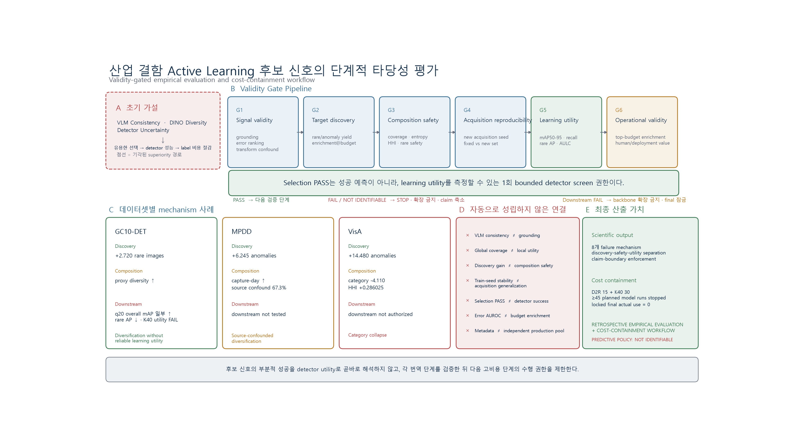
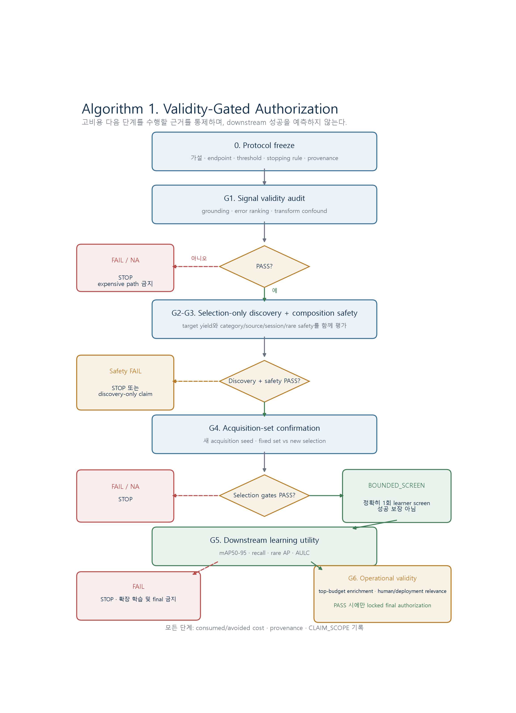
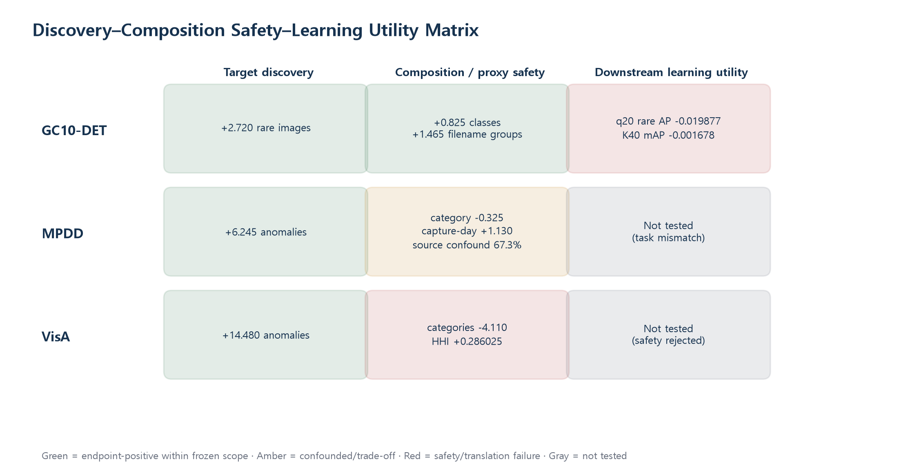
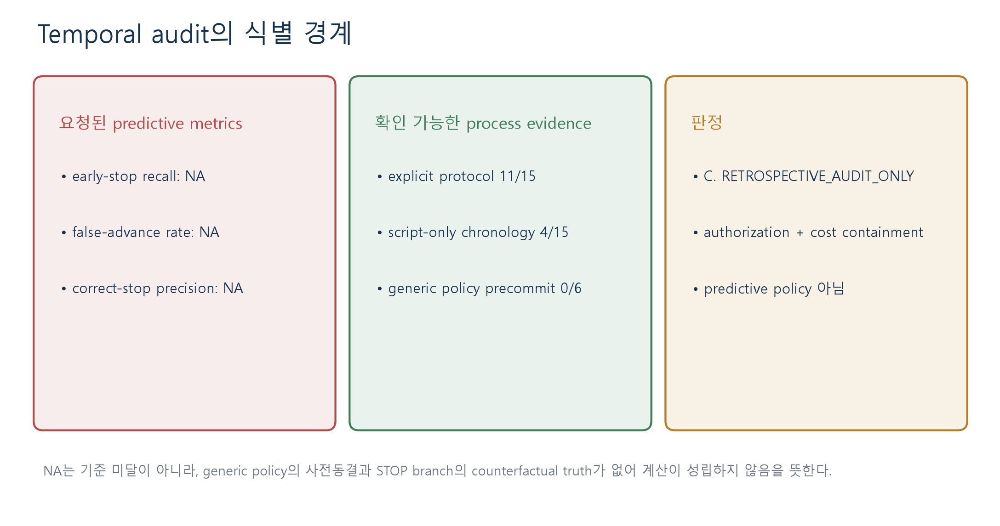

# 산업 결함 능동학습 후보 신호의 단계적 타당성 평가: 발견-안전성-학습 효용 간극 분석

**Validity-Gated Evaluation of Acquisition Signals for Industrial Defect Active Learning: Discovery, Safety, and Learning-Utility Gaps**

연구 방향 승인용 미니 논문 · 2026-07-18

> **중심 주장.** 산업 결함 Active Learning에서 후보 신호의 부분적 성공은 detector learning utility를 뜻하지 않는다. 본 연구는 후보 신호를 신호 타당성, 발견, 구성 안전성, acquisition-set 재현성, 학습 효용, 운영 타당성으로 분해하고, 각 단계의 근거가 충분할 때만 다음 고비용 검증을 허용하는 **validity-gated empirical evaluation and cost-containment workflow**로 재구성한다.

## 초록

**배경.** 산업 결함 객체검출은 이미지 단위 선택과 bounding-box annotation에 비용이 들기 때문에 Active Learning(AL)을 통해 먼저 라벨링할 이미지를 정하는 문제가 중요하다. 초기 연구는 VLM 설명 일관성, DINO 기반 시각 다양성, detector uncertainty가 Random보다 유용한 학습 표본을 선택할 것이라고 가정했다.

**문제.** 실험 결과는 이 selector-superiority 가설을 지지하지 않았다. VLM consistency는 grounded correctness와 예상 방향의 관계를 보이지 않았고, global representation coverage와 detector uncertainty의 부분적 신호도 실제 rare-class 학습 효용이나 작은 review budget의 운영 효용으로 안정적으로 번역되지 않았다. 따라서 높은 discovery score 또는 selection-stage 개선만으로 detector utility를 주장할 수 있는지가 핵심 연구 질문으로 바뀌었다.

**방법.** 후보 신호의 번역을 G1 Signal Validity, G2 Target Discovery, G3 Composition Safety, G4 Acquisition-Set Reproducibility, G5 Downstream Learning Utility, G6 Operational Validity의 여섯 단계로 분리했다. FAIL 또는 NOT IDENTIFIABLE은 다음 고비용 단계의 확장을 금지한다. Selection PASS는 성공 선언이 아니라 정확히 한 번의 bounded downstream screen을 허용하는 권한으로 정의했다. GC10-DET, NEU-DET, MPDD, VisA의 기존 결과와 15개 연구 branch를 evidence ledger로 추적했다.

**주요 결과.** GC10, MPDD, VisA에서 각각 rare/anomaly discovery가 +2.720, +6.245, +14.480 증가했지만, MPDD는 category -0.325와 source composition confound를 보였고 VisA는 category coverage -4.110 및 HHI +0.286025의 collapse를 보였다. GC10 q20에서는 overall mAP50-95가 +0.017378이었으나 rare macro AP는 -0.019877이었다. K40 selection coverage는 PASS했지만 mAP50-95 -0.001678, rare AP -0.018290, recall -0.021871로 downstream gate가 실패했다. NEU seed45 고정 집합은 +0.016236 및 5/5 training-seed 승리를 보였지만 새 acquisition sets에서는 +0.007019, 95% CI [-0.005211, 0.019678], p=0.322266으로 재현되지 않았다. Temporal audit의 predictive confusion matrix는 generic policy의 사전동결 부재와 STOP branch의 counterfactual 부재 때문에 NOT IDENTIFIABLE이었다. 반면 명시적으로 계획된 detector model run 최소 45개를 실행하지 않았고 locked final test의 actual use는 0회였다.

**기여.** 첫째, discovery, composition safety, acquisition reproducibility, learning utility를 서로 다른 endpoint로 다루는 단계적 empirical evaluation을 제시한다. 둘째, 세 fixed benchmark에서 discovery gain이 서로 다른 composition mechanism과 공존함을 정량화한다. 셋째, 부분적인 positive selection 결과를 제한된 downstream 검증으로만 연결하고, claim scope와 비용 소비를 함께 기록하는 authorization process를 제시한다.

**한계.** 본 연구는 retrospective study이며 generic policy가 prospective하게 사전등록되지 않았다. STOP branch의 downstream outcome, robust positive selector에 대한 sensitivity, independent production generalization, 실제 annotation 비용과 검사원 신뢰도는 식별되지 않았다. 비용 억제는 model-run lower bound만 보고하며 GPU-hours나 금액으로 환산하지 않는다.

**그림 1. 전체 연구 아키텍처.** 초기 superiority 가설, 여섯 단계 validity gate, 데이터셋별 mechanism, 자동으로 성립하지 않은 번역, 과학적·운영적 산출을 한 페이지에 통합했다. 중앙 문장은 Selection PASS가 성공 예측이 아니라 한 번의 bounded detector screen 권한임을 명시한다.

<!-- PAGEBREAK -->

# 1. 연구 배경과 문제 정의

산업 결함 검출에서 annotation budget은 단순한 이미지 수가 아니다. 한 이미지를 선택하면 결함 위치와 class를 확인하고 bounding box 또는 mask를 작성해야 하며, 작은 scratch나 균열은 검수 비용도 높다. Active Learning은 이 비용을 줄이기 위해 unlabeled pool에서 어떤 표본을 먼저 라벨링할지를 결정한다. 전통적으로 uncertainty, diversity, core-set coverage, ensemble disagreement와 같은 proxy가 사용되어 왔다[1-4]. 최근에는 VLM의 반복 설명과 semantic disagreement를 언어적 uncertainty로 이용할 가능성도 제기됐지만, 언어적 일관성과 시각적 진실성은 동일하지 않다.

초기 연구는 세 연결을 기대했다. 첫째, VLM 설명의 불일치가 epistemic uncertainty를 반영한다. 둘째, DINO diversity와 detector uncertainty를 결합하면 Random보다 학습에 유용한 표본을 고를 수 있다. 셋째, 좋은 선택은 같은 label budget에서 높은 detector mAP와 비용 절감으로 이어진다. 그러나 이 연결에는 최소 세 개의 번역 문제가 있다. VLM이 말하는 uncertainty가 실제 grounding error와 관련돼야 하고, 선택된 표본의 global visual difference가 local defect semantics와 관련돼야 하며, 선택 단계의 coverage가 실제 learner의 gradient와 rare-class 성능에 기여해야 한다.

본 연구의 결과는 위 화살표가 자동으로 성립하지 않음을 반복적으로 보였다. VLM consistency의 Spearman correlation은 -0.181199였고 severe-failure AUC는 0.373433이었다(E001-E002). Oracle crop에서도 positive presence, evidence, median IoU가 모두 0이었으며(E004), 세 Qwen-family 모델 중 frozen paired gate를 통과한 모델은 없었다(E005). DINO 기반 selection은 세 데이터셋에서 target discovery를 늘렸지만, 그 증가가 구성 안전성이나 detector utility로 동일하게 번역되지 않았다(E010-E022). 이 때문에 연구 질문은 “어떤 새로운 score가 Random을 이기는가?”에서 다음 질문으로 바뀌었다.

> **중심 연구 문제.** 산업 결함 Active Learning에서 후보 acquisition signal이 높은 discovery score 또는 선택 단계의 개선을 보였다는 사실만으로 실제 detector learning utility를 주장할 수 있는가?

현재 증거가 주는 답은 “아니다”이다. 후보 신호는 signal validity, target discovery, composition safety, acquisition-set reproducibility, downstream learning utility, operational validity로 분리해 검증해야 한다. 연구의 목적도 미래 성공을 맞히는 prediction이 아니라 다음 고비용 검증을 수행할 근거가 충분한지를 통제하는 authorization으로 재정의된다.

## 2. 연구 질문

1. **RQ1 - Discovery:** Candidate signal은 고정된 query budget에서 rare/anomaly target discovery를 실제로 증가시키는가?
2. **RQ2 - Safety:** Discovery gain은 category, source, session, rare-class 구성 안전성을 보장하는가?
3. **RQ3 - Reproducibility:** Selection-stage gain은 training seed가 아니라 acquisition set이 달라져도 유지되는가?
4. **RQ4 - Learning utility:** Selection-stage gain은 overall mAP, recall, rare AP와 같은 detector utility로 번역되는가?
5. **RQ5 - Authorization and cost:** Branch-specific frozen endpoint와 stopping rule은 고비용 확장, locked evaluation, 과도한 주장을 제한하는가?

RQ5는 predictive accuracy를 묻지 않는다. Generic policy는 전체 branch 종료 후 정식화됐고 STOP branch에는 실행하지 않은 downstream 결과가 없으므로 early-stop recall, false-advance rate, correct-stop precision을 계산할 수 없다. 본 연구가 평가할 수 있는 것은 기록된 endpoint와 gate가 실제로 다음 단계의 허용 범위와 claim scope를 제한했는지, 그리고 명시된 후속 run을 실행하지 않았는지이다.

<!-- PAGEBREAK -->

# 3. Validity-Gated Empirical Evaluation Workflow

본 workflow는 하나의 universal threshold를 적용하는 classifier가 아니다. 각 branch의 task와 endpoint는 다르지만, 다음 단계로 넘어가기 위한 증거의 역할을 공통 구조로 정리한다.

- **G1. Signal validity:** VLM grounding, detector error ranking, augmentation confound처럼 score가 의도한 현상을 측정하는지 검증한다.
- **G2. Target discovery:** 고정된 budget에서 anomaly 또는 rare-class image yield와 enrichment를 평가한다.
- **G3. Composition safety:** category/source/session coverage, entropy, HHI, instance richness, rare-class safety를 discovery와 함께 평가한다.
- **G4. Acquisition-set reproducibility:** 한 선택 집합의 training-seed 안정성과 새 acquisition seed의 재현성을 구분한다.
- **G5. Downstream learning utility:** mAP50-95, recall, rare AP, AULC처럼 learner가 실제로 개선되는지 확인한다.
- **G6. Operational validity:** 작은 review budget에서의 enrichment, human review value, deployment relevance를 평가한다.

운영 규칙은 다음과 같다. 첫째, 연구 가설, primary endpoint, threshold, stopping rule을 결과 전에 기록한다. 둘째, FAIL 또는 NOT IDENTIFIABLE이면 다음 고비용 단계의 확장을 금지한다. 셋째, 실패 mechanism을 확인하기 위한 cheap diagnostic은 허용하되 confirmatory evidence와 분리한다. 넷째, selection PASS는 downstream success를 뜻하지 않고 정확히 한 번의 bounded translation screen만 허용한다. 다섯째, downstream FAIL이면 backbone 확장과 final-test 접근을 금지한다. 마지막으로 모든 단계에서 provenance, consumed cost, explicitly avoided cost, claim scope를 기록한다.

**그림 2. Validity-gated authorization algorithm.** PASS는 다음 검증의 수행 권한이며 성공 보장이 아니다. FAIL/NA는 고비용 경로를 중단하고, selection-stage PASS 뒤에는 한 번의 learner screen만 허용한다.

## 4. 실험 자산과 데이터셋 역할

데이터셋을 동일 task 또는 동일 metric으로 취급하지 않았다. GC10-DET는 native bounding-box detection과 rare discovery, downstream detector translation에 사용했다. NEU-DET는 balanced large-pool Random baseline, fixed-set training stability, independent acquisition confirmation에 사용했다. MPDD와 VisA는 anomaly discovery와 composition mechanism audit에 사용했으며, task mismatch와 safety failure 때문에 GC10과 같은 detector translation을 수행하지 않았다.

| 데이터셋 | 본 연구의 역할 | 평가 단위 | downstream 범위 | 금지된 해석 |
|---|---|---|---|---|
| GC10-DET | rare/taxonomy discovery, K40 coverage, YOLO translation | fixed-pool paired acquisition seed 및 5 acquisition units | native bbox detector development screen | filename group을 official production group으로 해석 |
| NEU-DET | Random baseline, seed45 fixed-set stability, new acquisition confirmation | one fixed set x 5 train seeds; 10 acquisition seeds | YOLO development evaluation | fixed-set 안정성을 selector 일반화로 해석 |
| MPDD | anomaly discovery, capture-day/source composition audit | 200 paired leave-20 perturbations | 미수행(task mismatch) | EXIF day를 production lot으로 해석 |
| VisA | anomaly discovery, category collapse audit | 200 paired leave-20 perturbations | 미수행(safety rejected) | category를 independent capture session으로 해석 |

200 seeds는 200개의 독립 production pool이 아니다. Reconstructed pool의 mean Jaccard는 GC10 0.978446, MPDD 0.962827, VisA 0.995386으로 서로 크게 겹쳤다(E029-E031). 따라서 paired same-pool selection variation은 추정할 수 있지만 production-population confidence interval이나 prevalence moderation law는 주장하지 않는다.

<!-- PAGEBREAK -->

# 5. 결과 I: Signal validity와 discovery-composition mechanism

## 5.1 Signal validity failure

VLM consistency branch는 초기 연구의 가장 직접적인 가설을 검증했다. 95-image audit에서 consistency와 groundedness의 Spearman correlation은 -0.181199, bootstrap 95% CI [-0.389654, 0.036410]이었고, inconsistency의 severe-failure AUC는 0.373433이었다(E001-E002). 예상 방향과 반대이거나 chance 수준인 결과이므로 consistency를 direct epistemic uncertainty로 해석할 근거가 없었다. Structured prompt는 mean schema completeness 0.01로 실패했고(E003), 더 쉬운 oracle crop에서도 presence, evidence, median IoU가 0이었다(E004). 세 small Qwen-family model 비교도 0/3 pass였으며 best balanced accuracy 0.70조차 median IoU 0과 함께 나타났다(E005). 이는 단순 prompt formatting 문제가 아니라 semantic compliance와 visual grounding의 분리를 시사한다.

Detector-native signal도 동일한 검증을 통과하지 못했다. Horizontal-flip disagreement는 선택 표본 100개 중 94개가 one-view detection dominance를 보여 geometry/view sensitivity의 영향을 강하게 받았고, query instance delta -2.2로 safety gate가 실패했다(E024). V2.3 ensemble uncertainty는 majority-error AUROC 0.766432로 above-chance ranking을 보였지만(E026), primary endpoint인 top-20% total-error enrichment는 1.115901, CI [1.034640, 1.221093]으로 frozen threshold 1.50에 미달했다(E025). FN enrichment 1.379693과 rare-FN 1.785910은 secondary, post-hoc endpoint이며 각각 future protocol을 생성하는 exploratory evidence로만 남긴다(E027-E028).

## 5.2 Discovery gain과 composition change

세 데이터셋 모두에서 target discovery 증가가 관측됐지만 mechanism은 달랐다. GC10 DINO는 rare image를 평균 +2.720 늘리고 combined unique class를 +0.825 늘렸다(E010-E011). MPDD는 anomaly image +6.245였으나 category coverage -0.325로 frozen safety threshold를 통과하지 못했고, source-origin decomposition에서 observed gain의 67.3%가 official-test source composition과 연관됐다(E012-E014). VisA는 anomaly +14.480을 200/200 paired seeds에서 보였지만 category coverage -4.110, entropy -0.929016, HHI +0.286025의 category collapse가 동시에 나타났다(E015-E016).

**그림 3. Discovery-Composition-Safety-Learning Utility Matrix.** 동일한 discovery gain도 GC10의 diversification, MPDD의 source-confounded diversification, VisA의 category collapse로 구분된다. Gray는 downstream이 0이 아니라 미수행임을 뜻한다.

| branch | positive endpoint | 동반된 composition/safety | downstream 또는 판정 | 근거 |
|---|---:|---|---|---|
| GC10 DINO q20 | rare images +2.720 | classes +0.825; proxy groups +1.465 | detector rare AP -0.019877; gate FAIL | E010-E011, E017-E018 |
| MPDD DINO q20 | anomalies +6.245 | category -0.325; source contribution 67.3% | downstream 미수행; safety FAIL | E012-E014 |
| VisA DINO q20 | anomalies +14.480 | categories -4.110; HHI +0.286025 | downstream 미수행; safety rejected | E015-E016 |
| V2.3 uncertainty | AUROC 0.766432 | operational budget effect 1.115901 | primary gate FAIL | E025-E026 |

이 결과는 “DINO가 일관되지 않았다”는 의미보다, global representation이 데이터셋에서 가장 큰 시각적 분산을 따라가더라도 그 분산이 local defect utility와 같지 않을 수 있음을 보여준다. 즉 discovery gain은 실제였지만 그 과학적 의미는 dataset-specific mechanism과 함께 해석해야 한다.

<!-- PAGEBREAK -->

# 6. 결과 II: Selection-Learning Translation

## 6.1 Overall mAP와 rare safety의 충돌

GC10 q20 selection-only gate가 PASS했기 때문에 5 acquisition units x 3 training seeds의 bounded detector screen을 수행했다. Overall mAP50-95 delta는 +0.017378이었으나 rare macro AP delta는 -0.019877이었다(E017-E018). Overall 성능의 양의 결과만 보고하면 성공처럼 보이지만 frozen gate는 rare gain +0.020과 safety를 함께 요구했으므로 FAIL이다. 이 branch는 discovery 또는 average utility의 부분적 positive effect와 rare-class harm이 공존할 수 있음을 보여준다.

K40/140은 더 강한 반례다. 200 holdout seeds에서 all-class coverage rate 0.955로 Random140의 0.940보다 높아 selection gate를 통과했다(E019). 이 PASS는 detector success 선언이 아니라 30-model YOLOv8n bounded screen의 authorization이었다. Downstream 결과는 mAP50-95 -0.001678, rare macro AP -0.018290, recall -0.021871로 모두 불리했고 gate가 실패했다(E020-E022). 따라서 coverage PASS 이후 detector FAIL은 workflow의 false advance가 아니라 selection endpoint와 learning endpoint의 차이를 실제로 측정한 정상적인 bounded translation screen이다.

## 6.2 Training-seed stability와 acquisition generalization의 분리

NEU seed45 Visual20 고정 집합은 Random20 대비 mAP50-95 +0.016236을 보였고 다섯 training seeds에서 5/5 승리했다(E008). 이는 한 selected set의 효과가 단일 training seed noise만으로 설명되지 않음을 보여주는 descriptive positive result다. 그러나 동일 selector를 10개의 새로운 acquisition seeds에 적용한 confirmation에서는 평균 +0.007019, 95% CI [-0.005211, 0.019678], p=0.322266, 7/10 wins로 frozen gate가 실패했다(E009). 하나의 좋은 집합을 여러 번 학습하는 것과 새로운 좋은 집합을 반복해 선택하는 것은 서로 다른 재현성 축이다.

## 6.3 Strong Random과 cross-model acquisition risk

Balanced large-pool NEU에서 Random은 class coverage, instance diversity, bbox richness를 자연스럽게 포함했다(E006). Random은 특정 proxy를 최적화하지 않기 때문에 한 축의 집중으로 다른 축을 잃을 위험이 상대적으로 작았다. Selector가 DINO 또는 VLM의 representation을 사용하고 learner가 YOLO인 cross-model acquisition에서는 selector의 geometry가 learner의 gradient utility와 일치한다는 보장이 없다. 본 연구의 translation 결과는 selection metric을 learner metric의 대리값으로 취급하지 말아야 한다는 직접 근거다.

| 실험 | selection/fixed-set 결과 | independent/downstream 결과 | 최종 해석 |
|---|---|---|---|
| GC10 q20 | rare discovery +2.720; selection PASS | overall mAP +0.017378, rare AP -0.019877 | partial overall gain, rare-safety FAIL |
| K40/140 | all-class 0.955 vs 0.940; selection PASS | mAP -0.001678, rare -0.018290, recall -0.021871 | coverage-utility gap |
| NEU seed45 | +0.016236; 5/5 training seeds | new acquisition +0.007019; CI crosses 0; p=0.322266 | fixed-set stability ≠ acquisition generalization |
| V2.3 | AUROC 0.766432 | total-error enrichment 1.115901 < 1.50 | ranking ≠ operational enrichment |

<!-- PAGEBREAK -->

# 7. Temporal Audit, Authorization, and Cost Containment

15개 branch를 실제 기록 시각순으로 정리해 초기 9개와 후기 6개로 나눴다. 그러나 여섯 단계 generic policy는 주요 branch 종료 후 Evidence Freeze v2에서 정식화됐다. 후기 6개 중 generic policy가 precommitted된 branch는 0개였다. 또한 STOP branch는 downstream을 실행하지 않았기 때문에 SUCCESS/FAILURE 참값이 없다. 따라서 predictive confusion matrix, early-stop recall, false-advance rate, correct-stop precision, good-selector sensitivity는 모두 NOT IDENTIFIABLE/NA다. 이 값들은 threshold 미달이 아니라 통계적 식별 조건이 충족되지 않은 것이다.

Branch-specific process evidence는 더 제한적으로 보고한다. 15개 중 11개에는 explicit protocol artifact가 recorded outcome보다 앞서고, B01/B02/B09/B10 4개는 local script가 final summary보다 앞선 chronology만 존재한다. 파일 timestamp는 독립 preregistration 증거가 아니므로 4개를 사전동결 수치에 포함하지 않는다. 이 한계는 workflow를 prospectively validated policy로 부를 수 없는 이유다.

**그림 4. Temporal audit의 식별 경계.** Predictive metrics는 실패 수치가 아니라 NA이며, 식별 가능한 범위는 branch protocolization, bounded authorization, cost containment, claim-boundary enforcement이다.

그럼에도 운영적으로 확인된 효과는 있다. D2R class-8 representation gate는 계획된 15-model detector confirmation을 중단했고, K40 YOLOv8n downstream gate는 계획된 30-model YOLOv8s expansion을 중단했다. 두 계획은 겹치지 않으므로 documented lower bound는 45 model runs이다(E033). 다른 stopped branch의 unquantified run, VLM call, GPU-hour는 합산하지 않았다. Locked final test의 actual use는 0회였다(E034). 다만 “final-test uses avoided”는 counterfactual이므로 NA이며 0회라는 관측값과 혼동하지 않는다.

이 결과가 보여주는 workflow의 역할은 prediction이 아니라 authorization이다. Prediction은 미래 성공과 실패를 맞히는 문제다. Authorization은 현재 단계의 근거가 다음 고비용 측정을 정당화하는지를 결정한다. Selection PASS가 learner success를 보장하지 않더라도, bounded screen을 통해 그 번역을 측정할 정당성을 제공했다면 gate는 자신의 역할을 수행한 것이다. 반대로 downstream FAIL 뒤에 backbone search를 계속하거나 final test를 열었다면 claim scope와 비용 통제에 실패한 것이다.

<!-- PAGEBREAK -->

# 8. 종합 논의, 기여와 한계

## 8.1 네 가지 번역 간극

첫째, **Signal-Discovery Gap**은 계산 가능한 score가 target discovery에 유효하다는 보장이 없음을 뜻한다. VLM consistency와 flip disagreement가 대표적이다. 둘째, **Discovery-Safety Gap**은 target yield 증가가 category/source/session coverage를 보장하지 않음을 뜻한다. MPDD와 VisA는 같은 positive discovery가 전혀 다른 concentration mechanism과 함께 나타날 수 있음을 보였다. 셋째, **Selection-Learning Gap**은 coverage, taxonomy, rare image yield가 detector mAP, recall, rare AP로 자동 번역되지 않음을 뜻한다. GC10 q20과 K40이 이를 반복했다. 넷째, **Metadata-Generalization Gap**은 EXIF day, filename group, category가 존재하더라도 target-blind production unit이라는 문서가 없으면 independent pool을 만들 수 없음을 뜻한다(E032).

이 네 간극이 여러 실험을 하나의 연구 질문으로 묶는다. 각 branch는 다른 selector를 찾는 독립 실패가 아니라, Candidate Signal → Discovery → Safety → Reproducibility → Learning → Operational Validity 중 서로 다른 화살표를 검증했다. Positive result도 그 화살표의 범위 안에서만 유지되고, 다음 화살표의 결과를 대신하지 않는다.

## 8.2 연구 기여

**Primary contribution**은 산업 결함 AL 후보 신호를 여섯 단계의 endpoint로 분리하고, 다음 고비용 검증의 수행 권한을 frozen gate로 제한하는 empirical evaluation and cost-containment workflow다. 이는 성공하는 selector를 자동으로 찾아주는 optimization algorithm이 아니라, 불충분한 proxy evidence가 learner success 또는 production claim으로 승격되는 것을 막는 연구 방법론이다.

**Secondary contributions**은 세 가지다. 첫째, GC10, MPDD, VisA에서 fixed-pool discovery와 composition safety의 분리를 paired records로 정량화했다. 둘째, GC10/NEU에서 selection coverage와 training-seed stability가 detector utility 및 acquisition-set generalization과 다름을 보였다. 셋째, VLM grounding, DINO representation, flip disagreement, detector ranking, metadata proxy가 무너지는 여덟 failure mechanism과 stopping condition을 provenance와 함께 기록했다.

## 8.3 주장 경계

| 상태 | 본 논문에서의 주장 |
|---|---|
| Supported | discovery-safety separation; selection-learning separation; acquisition stability-generalization separation; 11 explicit protocol branches; documented lower bound 45; final actual use 0 |
| Conditional | fixed-benchmark acquisition robustness; dataset-specific discovery benefit; MPDD source-confounded diversification; GC10 rare discovery |
| Exploratory | FN 1.379693; rare-FN 1.785910; local feature misalignment와 recall-repair future hypothesis |
| Rejected | VLM consistency as direct epistemic uncertainty; universal selector superiority; global DINO utility guarantee; flip disagreement as epistemic uncertainty; sparsity law |
| Not identifiable | prospective predictive accuracy; independent production generalization; annotation cost reduction; inspector trust; good-selector sensitivity; stopped-branch counterfactual outcome |

## 8.4 한계

본 연구는 retrospective study이며 generic workflow의 prospective preregistration가 없다. Branch-specific protocol도 local timestamp에 기반한 process evidence일 뿐 외부 registry가 아니다. STOP branch의 downstream counterfactual과 robust positive selector에 대한 false-stop sensitivity를 알 수 없다. GC10은 object detection, MPDD와 VisA는 anomaly discovery/localization이므로 raw yield를 평균하거나 동일한 learner endpoint로 합칠 수 없다. 200 seeds는 highly overlapping fixed-pool perturbation이다. Independent production lot/time/source pool이 없고, FN triage는 reused development split과 18 rare images/22 boxes에 의존해 exploratory로만 남는다. Final test를 사용하지 않았으므로 final performance를 보고하지 않는다. Annotation 시간, monetary cost, GPU-hour, 검사원 신뢰, deployment latency도 측정하지 않았다.

# 9. 결론

본 연구는 새로운 acquisition score의 우월성을 입증하지 못했다. 대신 acquisition signal의 부분적 성공이 category/source safety와 detector learning utility를 자동으로 보장하지 않음을 반복적으로 확인했다. 이러한 결과를 바탕으로 고비용 detector 학습과 locked evaluation 이전에 각 번역 단계를 검증하고, 근거가 부족한 branch를 제한하는 validity-gated empirical evaluation and cost-containment workflow를 제안한다.

이 연구의 완결성은 “Random보다 이긴 selector”에 의존하지 않는다. 핵심은 후보 신호의 서로 다른 효용을 분리하고, positive endpoint와 동반 위험을 함께 기록하며, 다음 단계의 수행 권한과 claim boundary를 명시적으로 제한한 데 있다. Evidence Freeze v2의 판정은 **A. THESIS_REFRAME_STRONGLY_SUPPORTED**, temporal audit의 판정은 **C. RETROSPECTIVE_AUDIT_ONLY**이며 두 판정은 모순되지 않는다. 전자는 학위논문 재구성의 증거 충분성을, 후자는 predictive policy 주장의 불가능성을 뜻한다.

**대안 제목 1:** 산업 결함 Active Learning에서 선택 이득은 언제 학습 효용으로 번역되지 않는가: 단계별 실증 감사

**대안 제목 2:** 산업 결함 검출을 위한 Validity-Gated Acquisition Signal Audit와 비용 억제

<!-- PAGEBREAK -->

# 참고문헌 및 증거 추적

## 관련 연구

[1] Settles, B. *Active Learning Literature Survey*. University of Wisconsin-Madison, 2009.

[2] Sener, O., and Savarese, S. “Active Learning for Convolutional Neural Networks: A Core-Set Approach.” ICLR, 2018.

[3] Gal, Y., Islam, R., and Ghahramani, Z. “Deep Bayesian Active Learning with Image Data.” ICML, 2017.

[4] Kirsch, A., van Amersfoort, J., and Gal, Y. “BatchBALD: Efficient and Diverse Batch Acquisition for Deep Bayesian Active Learning.” NeurIPS, 2019.

[5] Caron, M. et al. “Emerging Properties in Self-Supervised Vision Transformers.” ICCV, 2021.

## 핵심 실험 evidence locator

- E001-E005: `runs/evidence_freeze_v2_20260718/research_evidence_ledger.csv`의 VLM validity rows.
- E010-E016: 같은 ledger의 GC10/MPDD/VisA discovery-composition rows.
- E017-E022: 같은 ledger의 GC10 q20 및 K40 downstream rows.
- E008-E009: 같은 ledger의 seed45 fixed-set/acquisition confirmation rows.
- E025-E028: 같은 ledger의 V2.3 operational/exploratory rows.
- E029-E032: 같은 ledger의 fixed-pool/metadata identifiability rows.
- E033-E034 및 `docs/framework_cost_avoidance_summary_20260718.csv`: documented model-run lower bound와 final actual use.

## 그림 caption: temporal audit 부속 그림

- `framework_advance_stop_timeline.png`: 15개 branch의 실제 chronology를 보이지만 후기 35%에 generic policy가 pre-frozen되지 않아 predictive temporal holdout으로 해석할 수 없다.
- `framework_cost_avoidance.png`: 실제 사용하지 않은 planned model runs만 합산한 lower bound 45를 보이며 GPU-hours는 추정하지 않고 final-test counterfactual avoided use는 NA로 둔다.
- `framework_temporal_validation.png`: predictive metrics는 기준 미달이 아니라 not identifiable이고, 식별 가능한 기여는 protocolization, bounded authorization, cost containment임을 보인다.
