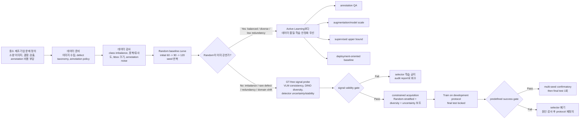
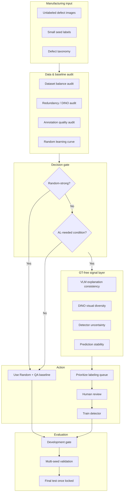

# Reframed GT-free Active Learning Workflow after V10c/V10d Evidence

작성일: 2026-07-13  
상태: V10b/V10c/V10d 결과 반영 후 연구 가설 재정의  
Final test: locked / unused  
핵심 전환: “새 selector로 Random을 이긴다”에서 “Random이 강한 조건을 감사하고, Active Learning이 필요한 조건에서만 GT-free signal을 쓴다”로 전환

---

## 1. 한 문장 결론

중소 제조기업의 결함 검출 도입 시나리오에서 GT-free Active Learning은 여전히 유효한 접근이지만, **balanced small benchmark에서는 Random이 이미 강한 sampling policy로 작동할 수 있으므로, selector를 바로 제안하기보다 먼저 데이터가 Active Learning을 필요로 하는 조건인지 감사해야 한다.**

따라서 연구 가설은 다음처럼 바뀐다.

> 기존 가설: VLM explanation consistency, DINO diversity, detector uncertainty를 조합하면 Random보다 좋은 GT-free acquisition strategy를 만들 수 있다.  
> 수정 가설: GT-free signal은 항상 Random을 이기는 selector가 아니라, 데이터 부족 제조 현장에서 **Random baseline이 약해지는 조건을 진단하고, imbalance/redundancy/rare-defect 상황에서 annotation priority를 보조하는 audit-and-triage layer**로 쓰일 때 더 방어 가능하다.

---

## 2. 왜 방향을 바꾸는가

### 확인된 결과

| 실험 | 목적 | 결과 | 판정 |
|---|---|---:|---|
| V10b seed43-46 | frozen detector-aware selector가 Random을 일반화해서 이기는지 확인 | mAP50-95 +0.000949 | 거의 동률 |
| V10c24 seed47-50 | V10b recall penalty 완화 | mAP50-95 +0.001542, recall +0.011695 | 제한적 후보 |
| PDF V10c 21/9 | low-box recall guard | seed47 mAP50-95 -0.017937, recall -0.043507 | 중단 |
| V10d stability probe | perturbation instability가 detector error를 예측하는지 확인 | signal은 일부 있으나 selector gate 실패 | 학습 금지 |
| V10c24 seed51 round2 | budget 120에서 살아나는지 확인 | round2 mAP50-95 -0.004863, gate 0/1 | 확장 실패 |

### 가장 중요한 감사 결과

Random baseline audit에서 Random은 단순한 약한 baseline이 아니었다.

- GT class coverage가 안정적으로 6/6에 가까움
- class entropy가 높음
- 실제 bbox 수와 multi-instance rate가 V10c24보다 낮지 않음
- V10c24는 detector uncertainty를 더 강하게 타지만, 실제 learnable instance richness에서는 Random보다 항상 낫지 않았음

즉 현재 NEU balanced large-pool protocol에서는:

```text
Random = weak baseline 이 아님
Random = 균형 잡힌 class/instance/diversity sampler에 가까움
```

---

## 3. 수정된 전체 워크플로우



---

## 4. 기존 아이디어는 어디에 남는가

기존 VLM/GT-free Active Learning 구성요소를 버리는 것이 아니다. 역할을 바꾼다.

| 기존 구성요소 | 기존 역할 | 수정된 역할 |
|---|---|---|
| VLM explanation consistency | main acquisition score 후보 | image-level ambiguity / labeling risk audit |
| DINO visual diversity | Random보다 다양한 샘플 선택 | redundancy audit + tie-breaker |
| Detector uncertainty | hard sample 선택 | detector blind spot 후보 탐지, 단독 selector 금지 |
| Pseudo instance count | instance-rich sample 선택 | annotation cost / learnability proxy, 단조 가정 금지 |
| Perturbation stability | V10d selector 후보 | detector error signal validity probe |
| Random baseline | 비교용 약한 baseline | 반드시 이겨야 하는 강한 operational baseline |

---

## 5. 제조기업 도입 시나리오로 다시 그린 연구 프레임

### 현장 시나리오

중소 제조기업은 보통 다음 제약을 가진다.

- 결함 이미지가 많지 않음
- 결함 class 정의가 자주 바뀜
- annotation 담당자가 부족함
- 모델을 처음부터 크게 학습하기 어려움
- “어떤 이미지를 먼저 라벨링해야 하는지”가 실제 비용 문제임

따라서 제안할 수 있는 시스템은 “무조건 좋은 selector”가 아니라 다음과 같은 **의사결정 워크플로우**다.

```text
1. 소량 이미지 수집
2. 최소 annotation seed 구성
3. Random baseline 학습
4. 데이터 감사로 Random이 강한지 확인
5. Random이 충분하면 단순 baseline + 품질관리로 진행
6. Random이 약하면 GT-free signal로 annotation priority 추천
7. 추천된 샘플은 사람이 검수하고 라벨링
8. detector 재학습
9. development gate 통과 후 final test 1회
```

---

## 6. 새 연구 질문

이제 연구 질문은 다음처럼 바꾸는 것이 방어 가능하다.

### RQ1. 언제 Random baseline이 충분히 강한가?

NEU balanced protocol에서는 Random이 이미 class/instance diversity를 확보했다. 따라서 다음 지표가 Random-strong condition의 후보가 된다.

- class entropy
- class coverage
- image-level redundancy
- bbox count / area distribution
- multi-instance ratio
- initial budget 대비 learning curve slope

### RQ2. GT-free signal은 언제 도움이 되는가?

GT-free signal은 balanced dataset에서 항상 mAP를 올리는 selector가 아니라, 다음 조건에서 annotation priority를 돕는지 확인해야 한다.

- class imbalance
- rare defect
- redundant pool
- domain shift
- low-quality / ambiguous images
- annotation budget이 극도로 작은 상황

### RQ3. Active Learning은 성능 향상 방법인가, 비용 절감 방법인가?

이번 결과는 mAP endpoint만 보면 V10c24가 Random을 이기지 못했지만, 일부 seed/round에서 recall/F1/AULC 신호는 있었다. 따라서 제조 도입 관점에서는 다음을 분리해야 한다.

- 최고 성능 향상
- annotation cost 절감
- rare defect 발견
- labeling queue prioritization
- model risk audit

---

## 7. 앞으로의 실험 설계

새 selector를 더 만드는 대신, 다음 세 가지 protocol을 분리한다.

### Protocol A. Balanced benchmark conclusion

목적: 현재 NEU balanced protocol에서 결론 고정

- Random baseline is strong.
- V10b/V10c24 did not robustly beat Random.
- V10d signal is interesting but not trainable as a selector yet.
- Final test는 아직 사용하지 않는다.

### Protocol B. Random-strong condition audit

목적: Random이 강한 이유를 논문화

필수 분석:

- Random selected set의 class entropy
- bbox count / multi-instance richness
- DINO redundancy
- detector confidence / uncertainty distribution
- per-class AP delta와 selection property 연결

### Protocol C. AL-needed stress protocol

목적: Active Learning이 실제로 필요한 조건에서만 GT-free signal을 검증

후보 조건:

1. Long-tail pool
   - 특정 defect class를 희귀하게 만든다.
   - 성공 기준: rare class recall/AP 개선.

2. Redundant pool
   - 유사 이미지가 많은 pool을 구성한다.
   - 성공 기준: Random보다 중복 선택 감소, 동일 budget 성능 개선.

3. Cold-start small budget
   - initial 12/18/30처럼 더 작은 seed.
   - 성공 기준: early slope / AULC 개선.

4. Domain-shift pool
   - 조명/표면/촬영조건이 다른 후보군.
   - 성공 기준: detector uncertainty/stability signal이 domain gap을 포착.

---

## 8. 새 시스템 아키텍처



---

## 9. 발표/보고서에서 쓸 수 있는 결론 문장

> 본 연구는 VLM explanation consistency 및 detector-aware GT-free active learning을 결함 검출 annotation 절감 문제에 적용했다. 초기 가설은 GT-free signal 조합이 Random acquisition을 안정적으로 능가할 수 있다는 것이었으나, NEU-DET balanced large-pool protocol에서 Random은 class coverage와 instance diversity를 이미 충분히 확보하는 강한 baseline으로 작동했다. V10b와 V10c24는 일부 seed와 recall/F1 지표에서 개선 신호를 보였지만, multi-seed 및 budget-120 확장에서는 Random을 안정적으로 능가하지 못했다. 따라서 본 연구의 방향은 새로운 selector 탐색에서 벗어나, 제조 현장에서 Active Learning이 실제로 필요한 조건을 먼저 감사하고, imbalance/redundancy/rare-defect 상황에서 GT-free signal을 annotation prioritization layer로 사용하는 workflow로 재정의된다.

---

## 10. 다음 행동

1. 현재 결과를 “실패”가 아니라 “Random-strong balanced benchmark 결론”으로 고정한다.
2. V10e/V10f selector 개발은 중단한다.
3. `Random baseline audit` 문서를 보고서 본문에 편입한다.
4. NEU balanced protocol은 더 이상 method tuning에 쓰지 않는다.
5. 다음 실험은 “AL-needed stress protocol”로 새로 설계한다.
6. final test는 method/protocol이 완전히 고정된 후 1회만 사용한다.

