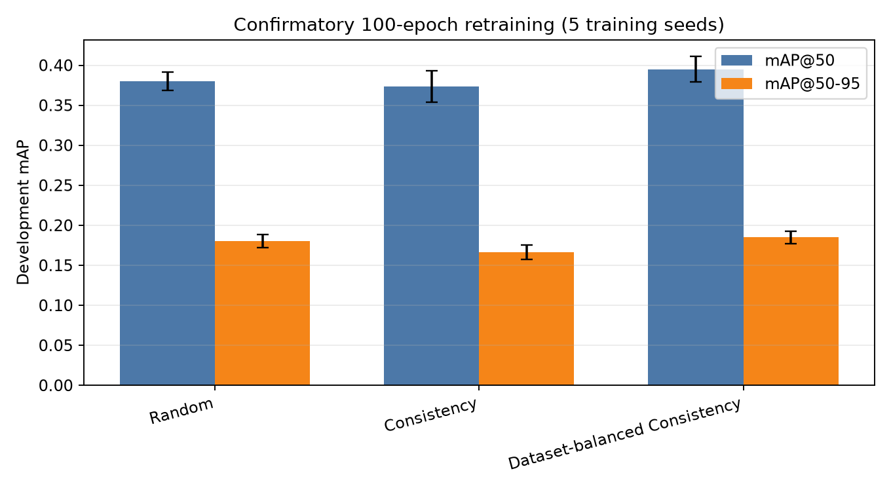
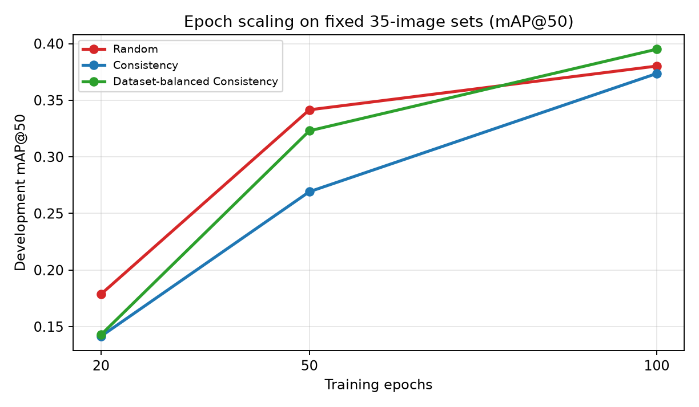
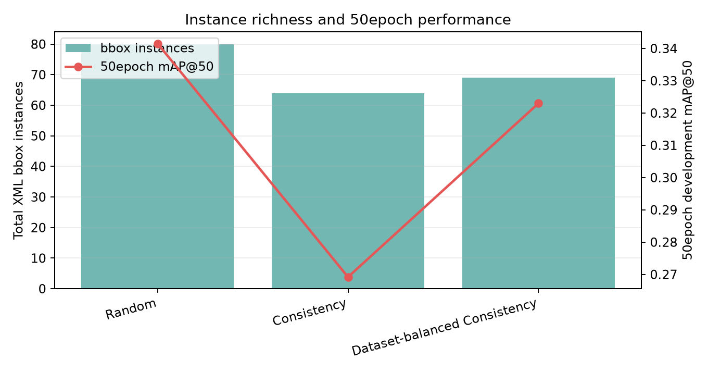
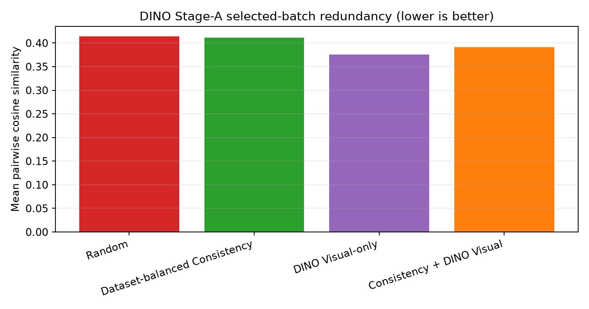
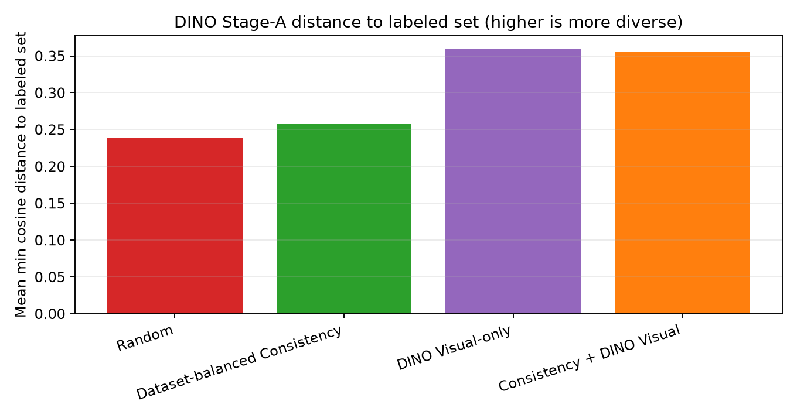

# VLM 기반 GT-free Active Learning 연구 로그 v1

문서 상태: Interim Research Log / Methodology Development Report  
작성일: 2026-07-11  
프로젝트: `Defect_VLM_Project`  
저장소 경로: `C:\Users\user\Desktop\vlm\Defect_VLM_Project`  
주제: VLM 설명 불일치와 GT-free acquisition을 활용한 산업 결함 탐지 Active Learning  
데이터셋: NEU-DET, GC10-DET 혼합 defect detection 데이터  
Detector: YOLOv8n  
VLM / embedding 관련 구성: VLM prompt consistency score, pseudo box proxy, DINOv2-small visual embedding  
문서 목적: 현재까지 완료된 실험 결과와 방법론 수정 과정을 논문 Results/Discussion 및 발표 자료의 기반으로 정리  
final test 사용 여부: No  
진행 중 실험 포함 여부: No. V7 DINO final 35-set gate training은 진행 중으로 보고 결론 산출에서 제외

---

## 0. 사용한 완료 결과 폴더

이번 문서는 현재 실행 중인 YOLO gate training을 건드리지 않고, 완료된 결과 폴더만 읽어서 작성했다.

| 단계 | 사용한 결과 폴더 |
|---|---|
| V6 20epoch AL | `runs\active_learning_ablation_v6_deficit_diversity\al_ablation_v6_deficit_diversity_20260711_154333` |
| Methodology audit | `runs\methodology_audit_v7\audit_20260711_164343` |
| Full-pool upper-bound reference | `runs\yolo_upper_bound_v7\upper_bound_20260711_164757` |
| 50epoch training variance | `runs\training_variance_v7\training_variance_20260711_165852` |
| Evaluation protocol | `runs\evaluation_protocol_v7\eval_protocol_20260711_173723` |
| Instance richness | `runs\instance_richness_v7\instance_richness_20260711_173855` |
| 100epoch confirmatory training | `runs\confirmatory_training_v7\confirmatory_training_20260711_175100` |
| DINO embedding cache | `outputs\visual_embeddings_v7\dinov2_20260711_193147` |
| V7 DINO Stage-A selection-only | `runs\active_learning_ablation_v7_visual_instance\v7_visual_instance_screening_20260711_193318` |

진행 중이거나 중간 상태일 수 있어 본문 결론에서 제외한 폴더:

- `runs\v7_final_set_gate_training\v7_final_set_gate_training_20260711_193559`
- `runs\v7_final_set_gate_training\v7_final_set_gate_training_20260711_193613`

---

## 1. 연구 배경과 문제 정의

산업 결함 탐지에서는 모든 이미지에 bounding box annotation을 부여하는 비용이 크다. 특히 steel surface defect처럼 결함 크기와 형태가 다양하고, 결함 클래스가 데이터셋마다 다르게 정의되는 경우에는 단순히 많은 이미지를 무작위로 라벨링하는 방식이 비효율적일 수 있다.

이 연구의 기본 목표는 동일한 GT-free label budget에서 Random보다 더 효율적으로 detector 성능을 끌어올리는 acquisition 전략을 찾는 것이다. 여기서 GT-free는 acquisition 단계에서 실제 XML annotation, class label, bbox count를 사용하지 않는다는 의미다. 라벨링 후 YOLO 학습과 평가에는 정상적인 detection annotation을 사용한다.

초기 가설은 VLM이 이미지에 대해 여러 prompt 또는 설명을 생성했을 때, 설명 간 불일치가 큰 이미지는 detector가 학습하기에 정보량이 높을 수 있다는 것이었다. 따라서 VLM explanation consistency를 acquisition score로 활용하고, 이후 실험을 통해 dataset balancing, training duration, instance richness, visual diversity의 영향을 분리했다.

---

## 2. 연구 질문

현재까지의 실험은 다음 질문을 분리해서 검증하는 방향으로 진행되었다.

1. VLM 설명 불일치가 detector utility를 대변하는가?
2. Dataset balancing은 consistency acquisition의 편향을 줄이는가?
3. 낮은 초기 mAP는 acquisition 실패 때문인가, YOLO 학습 부족 때문인가?
4. Random이 강하게 보이는 이유가 실제 bbox instance-richness 때문인가?
5. DINOv2 visual diversity는 선택 중복을 줄이고 detector 성능 향상으로 이어질 수 있는가?
6. 개발용 평가 세트에서 반복 실험을 수행하되, final test는 방법과 hyperparameter를 lock한 뒤 한 번만 사용하도록 분리할 수 있는가?

---

## 3. 전체 방법론 흐름

현재 pipeline은 다음 순서로 구성된다.

1. Unlabeled pool 구성
2. VLM prompt / explanation 생성
3. Prompt-family consistency 계산
4. GT-free priority score 계산
5. Dataset cumulative deficit balancing 적용
6. Query batch 선택
7. 선택된 이미지에 대해 YOLO 학습
8. fixed development evaluation에서 성능 측정
9. acquisition seed와 training seed를 분리하여 반복 평가

Consistency uncertainty는 다음처럼 해석한다.

```text
U_c(x) = 1 - C(x)
```

여기서 `C(x)`는 prompt 설명 간 consistency이며, `U_c(x)`가 클수록 VLM 설명 불일치가 큰 샘플이다.

Dataset-balanced acquisition은 단순히 score가 높은 이미지를 고르는 대신, 누적 선택량이 부족한 dataset source를 먼저 채우는 방식이다.

```text
x* = argmax U_c(x), subject to cumulative dataset deficit quota
```

DINO visual diversity는 현재 labeled set과 이번 round에서 이미 선택된 set에 가까운 이미지를 피하는 방식으로 사용했다.

```text
D_v(x) = min distance(x, L ∪ S)
```

V7 DINO Stage-A에서 사용한 hybrid score는 다음과 같다.

```text
S(x) = 0.5 U_c(x) + 0.5 D_v(x)
```

이번 문서 기준으로 pseudo-instance score는 main branch에서 제외했다. 이전 실험에서 pseudo box count가 실제 XML bbox richness와 안정적으로 대응하지 않았기 때문이다.

---

## 4. 초기 V6 20epoch Active Learning 결과

V6는 seed 42 하나, initial seed 15장, query 5장 × 4 rounds, 최종 35장 label budget으로 실행되었다. YOLO 학습은 20epoch, patience 3이었다.

결과 파일:

- `seed_strategy_metric_summary.csv`
- `aggregate_strategy_metric_summary.csv`
- `all_round_results.csv`
- `paired_strategy_comparisons.csv`

### 4.1 최종 35장 기준 V6 결과

| Strategy | final mAP@50 | final mAP@50-95 | 해석 |
|---|---:|---:|---|
| OracleClassDatasetBalancedRandom | 0.194869 | 0.083798 | oracle diagnostic 중 가장 높음 |
| GTFreeRandom | 0.178651 | 0.084741 | GT-free baseline 중 가장 높음 |
| OracleClassDatasetBalancedConsistency | 0.154948 | 0.063591 | oracle balancing을 넣어도 consistency만으로는 제한적 |
| GTFreeDatasetBalancedConsistency | 0.142793 | 0.057631 | consistency-only보다는 약간 높지만 Random보다 낮음 |
| GTFreeConsistency | 0.141446 | 0.058910 | consistency-only 약세 |
| GTFreeConsistencyPseudoFeatureDiversity | 0.079889 | 0.037958 | pseudo-feature diversity는 크게 붕괴 |

초기 해석만 보면 Random이 가장 안정적이고 consistency 계열은 실패처럼 보였다. 그러나 이후 audit과 retraining 결과를 보면 이 결론은 너무 빠른 판단이었다. 20epoch와 patience 3은 특히 저예산 detection setting에서 과소학습을 유발했고, acquisition strategy 간 차이를 제대로 관측하기 어려운 조건이었다.

---

## 5. Methodology Audit

Methodology audit은 낮은 mAP가 단순 pipeline 오류 때문인지 확인하기 위해 수행했다.

결과 파일:

- `audit_summary.md`
- `xml_to_yolo_conversion_audit.csv`
- `invalid_or_suspicious_boxes.csv`
- `image_class_hint_vs_xml_class_mismatch.csv`
- `pool_eval_exact_overlap.csv`
- `pool_eval_perceptual_hash_overlap.csv`
- `training_run_convergence_audit.csv`

### 5.1 Audit verdict

| 항목 | 결과 |
|---|---:|
| Severe issue count | 0 |
| Missing XML object/image rows | 0 |
| Unknown class rows | 0 |
| Invalid-after-clip boxes | 0 |
| Exact pool/eval overlap | 0 |
| class_hint absent from XML instance classes | 7 |
| Perceptual near-overlaps | 36 |
| Latest V6 target 내 early-stopped YOLO runs | 3 |

Audit 결론은 “pipeline audit passed with warnings”이다. 즉 XML 누락, class mapping 붕괴, exact leakage 같은 치명적 문제는 없었다.

다만 두 가지 warning은 연구 해석에서 중요하다.

첫째, GC10 pool의 class composition이 극단적으로 skewed되어 있었다. priority pool의 GC10-DET는 class_hint 기준 crease가 48장이고 waist_folding이 1장뿐이었다. XML instance 기준으로는 inclusion, rolled_pit, silk_spot, water_spot도 일부 포함되어 있어 class_hint와 실제 XML instance class가 완전히 일치하지 않는 경우가 존재했다.

둘째, perceptual hash near-overlap 36건이 확인되었다. exact overlap은 아니지만 dev/final split 설계와 해석에서 보수적으로 다뤄야 한다.

### 5.2 Audit 후 방법론 수정

Audit 이후 연구 방향은 “pipeline이 망가져서 낮은 mAP가 나온 것”이 아니라 다음 가능성을 분리하는 쪽으로 바뀌었다.

- 학습 데이터가 너무 적다.
- 20epoch / patience 3으로 YOLO가 충분히 학습하지 못했다.
- Random이 우연히 bbox instance가 많은 이미지를 선택했다.
- consistency-only acquisition은 detector utility와 직접적으로 맞지 않을 수 있다.
- dataset balancing 또는 visual diversity가 consistency의 약점을 보완할 수 있다.

---

## 6. Full-pool upper-bound reference

Upper-bound reference는 priority pool 전체 99장을 사용해 YOLO를 학습하고, development eval 180장에서 평가했다. 이 실험은 전체 공개 benchmark SOTA를 의미하지 않는다. 현재 priority pool과 현재 evaluation split 하에서 detector pipeline이 어느 정도 학습 가능한지 확인하는 reference이다.

결과 파일:

- `upper_bound_summary.md`
- `all_upper_bound_results.csv`
- `aggregate_upper_bound_results.csv`
- `dataset_build_log.csv`

| Train size | Eval size | mAP@50 | mAP@50-95 |
|---:|---:|---:|---:|
| 99 | 180 | 0.478461 | 0.226207 |

이 결과는 중요하다. 동일한 conversion과 evaluation pipeline에서 99장을 모두 쓰면 mAP@50이 0.478461까지 올라간다. 따라서 V6의 낮은 mAP는 pipeline이 학습 불가능해서가 아니라, low-budget 35장 setting과 under-training의 영향이 크다고 해석하는 것이 타당하다.

---

## 7. 50epoch training variance

50epoch training variance는 acquisition 결과를 고정한 뒤, training seed만 바꿔 YOLO retraining variance를 확인한 실험이다. 목적은 acquisition strategy 차이가 YOLO 학습 randomness보다 충분히 큰지 분리하는 것이었다.

결과 파일:

- `training_variance_results.csv`
- `training_variance_metric_summary.csv`
- `signal_to_training_noise.csv`
- `frozen_labeled_sets.csv`

| Strategy | mAP@50 mean | mAP@50 std | mAP@50-95 mean | mAP@50-95 std | Training seeds |
|---|---:|---:|---:|---:|---:|
| GTFreeRandom | 0.341508 | 0.020384 | 0.156191 | 0.012736 | 2 |
| GTFreeDatasetBalancedConsistency | 0.322979 | 0.002592 | 0.134951 | 0.001739 | 2 |
| GTFreeConsistency | 0.269188 | 0.059356 | 0.121975 | 0.030305 | 2 |

50epoch 결과는 20epoch 결과가 전략의 진짜 성능을 과소평가했음을 보여준다. 특히 같은 35장 set을 더 오래 학습하자 mAP@50이 크게 상승했다.

그러나 50epoch에서는 Random이 여전히 가장 높았다. 이 시점에서 Random의 우위가 acquisition 품질 때문인지, 더 많은 bbox instance를 포함했기 때문인지 추가 분석이 필요했다.

---

## 8. Confirmatory 100epoch retraining

100epoch confirmatory training은 현재까지 가장 중요한 완료 결과다. V6에서 얻은 최종 35장 set을 고정하고, 5개 training seed로 다시 학습했다. 평가는 development eval에서만 수행했다.

결과 파일:

- `confirmatory_training_results.csv`
- `confirmatory_metric_summary.csv`
- `paired_training_seed_differences.csv`
- `runtime_profile.csv`



### 8.1 Strategy mean

| Strategy | mAP@50 mean | mAP@50 std | mAP@50-95 mean | mAP@50-95 std | Training seeds |
|---|---:|---:|---:|---:|---:|
| GTFreeDatasetBalancedConsistency | 0.395043 | 0.015784 | 0.184955 | 0.007804 | 5 |
| GTFreeRandom | 0.380168 | 0.011495 | 0.179881 | 0.008218 | 5 |
| GTFreeConsistency | 0.373548 | 0.019805 | 0.166402 | 0.008838 | 5 |

100epoch에서는 DatasetBalancedConsistency가 평균 성능 1위가 되었다. Random과의 차이는 크지 않지만, matched training seeds 기준으로 mAP@50과 mAP@50-95 모두 4승 1패였다.

### 8.2 Paired comparison

| Treatment | Baseline | Metric | Mean paired diff | Wins | Losses | exact sign-flip p |
|---|---|---|---:|---:|---:|---:|
| DatasetBalancedConsistency | Random | mAP@50 | +0.014875 | 4 | 1 | 0.1875 |
| DatasetBalancedConsistency | Random | mAP@50-95 | +0.005074 | 4 | 1 | 0.3750 |
| DatasetBalancedConsistency | Consistency | mAP@50 | +0.021495 | 4 | 1 | 0.1250 |
| DatasetBalancedConsistency | Consistency | mAP@50-95 | +0.018553 | 5 | 0 | 0.0625 |
| Consistency | Random | mAP@50 | -0.006620 | 2 | 3 | 0.6250 |
| Consistency | Random | mAP@50-95 | -0.013479 | 2 | 3 | 0.2500 |

해석은 조심해야 한다. seed가 5개뿐이므로 통계적으로 확정적이라고 표현할 수는 없다. 그러나 development set에서 DatasetBalancedConsistency는 Random보다 평균적으로 높고, Consistency-only보다 더 안정적으로 높았다. 따라서 현재 주 방법론 후보는 consistency-only가 아니라 DatasetBalancedConsistency로 보는 것이 맞다.

---

## 9. Epoch 부족 문제

20epoch, 50epoch, 100epoch 결과를 나란히 보면 초기 V6의 낮은 성능이 상당 부분 under-training 때문이었음이 분명하다.



| Strategy | 20epoch mAP@50 | 50epoch mAP@50 | 100epoch mAP@50 |
|---|---:|---:|---:|
| GTFreeRandom | 0.178651 | 0.341508 | 0.380168 |
| GTFreeConsistency | 0.141446 | 0.269188 | 0.373548 |
| GTFreeDatasetBalancedConsistency | 0.142793 | 0.322979 | 0.395043 |

특히 consistency 계열은 20epoch에서 매우 낮게 보였지만 100epoch에서는 Random에 가까워지거나, DatasetBalancedConsistency의 경우 Random 평균을 넘어섰다. 따라서 “consistency 전략은 실패했다”라는 초기 결론은 수정되어야 한다.

수정된 해석:

- 20epoch 결과는 저예산 detection setting에서 과소평가였다.
- Consistency-only는 여전히 Random보다 약하거나 비슷한 수준이다.
- Dataset balancing을 결합하면 consistency signal이 더 안정적으로 활용된다.
- AL 평가에서는 detector training schedule을 충분히 확보해야 한다.

---

## 10. Instance richness 분석

Random의 강점을 설명하기 위해 실제 XML bbox instance 수, class entropy, bbox geometry를 분석했다. 이 분석은 acquisition에는 사용하지 않았고, 실험 후 해석용으로만 사용했다.

결과 파일:

- `instance_richness_vs_performance.csv`
- `frozen_set_actual_instance_statistics.csv`
- `frozen_set_actual_class_distribution.csv`
- `frozen_set_bbox_geometry_statistics.csv`



| Strategy | Total bbox instances | Mean bbox / image | Multi-object image ratio | Actual class entropy | 50epoch mAP@50 | 50epoch mAP@50-95 |
|---|---:|---:|---:|---:|---:|---:|
| GTFreeRandom | 80 | 2.285714 | 0.685714 | 2.684797 | 0.341508 | 0.156191 |
| GTFreeDatasetBalancedConsistency | 69 | 1.971429 | 0.600000 | 2.803188 | 0.322979 | 0.134951 |
| GTFreeConsistency | 64 | 1.828571 | 0.514286 | 2.478320 | 0.269188 | 0.121975 |

Random은 실제 bbox instance 수가 가장 많았다. 따라서 Random이 20/50epoch에서 강하게 나온 이유 중 하나는 instance-richness일 가능성이 있다.

다만 bbox 수만으로 모든 성능을 설명할 수는 없다. 100epoch에서는 DatasetBalancedConsistency가 Random보다 적은 bbox instance를 포함했음에도 평균 mAP@50과 mAP@50-95에서 앞섰다. 즉 instance-richness는 중요한 요인이지만, dataset composition과 consistency signal도 성능에 기여할 수 있다.

---

## 11. Evaluation protocol

개발용 평가와 최종 테스트를 분리하기 위해 evaluation protocol을 생성했다.

결과 파일:

- `development_eval_v7.csv`
- `final_test_v7.csv`
- `final_test_v7_hash_audit.csv`
- `evaluation_protocol_summary.md`
- `evaluation_protocol_v7.json`

| Split | Size | 용도 |
|---|---:|---|
| development_eval_v7 | 180 | 방법론 개발, screening, ablation |
| final_test_v7 | 180 | method/hyperparameter lock 후 단 한 번 평가 |

development_eval_v7은 V6 fixed external eval을 기반으로 하며, 대부분 NEU-DET로 구성되어 있다.

| development_eval_v7 dataset | Count |
|---|---:|
| GC10-DET | 3 |
| NEU-DET | 177 |

final_test_v7은 class-space가 더 넓고 GC10 비중이 높다.

| final_test_v7 dataset | Count |
|---|---:|
| GC10-DET | 112 |
| NEU-DET | 68 |

중요한 해석상 주의점:

- development_eval은 방법론 개발용으로 반복 접근했다.
- final_test_v7은 아직 평가하지 않았다.
- final_test_v7은 GC10 class-space가 훨씬 넓기 때문에, 현재 priority pool의 GC10 crease 편중과 충돌할 수 있다.
- 따라서 final test는 방법 고정 후 robustness stress test에 가깝게 해석해야 한다.

---

## 12. V7 DINO Visual Diversity Stage-A

V7 Stage-A는 YOLO 학습 없이 selection behavior만 확인한 실험이다. handcrafted embedding smoke test 이후, 실제 DINOv2-small embedding으로 다시 실행했다.

DINO embedding cache:

| 항목 | 값 |
|---|---|
| Backend | dinov2 |
| Model | facebook/dinov2-small |
| Device | CUDA |
| AMP | true |
| Embedding dim | 384 |
| Num embeddings | 99 |
| Runtime | 20.98 sec |

Stage-A 결과 파일:

- `visual_redundancy_by_round.csv`
- `selected_sample_distance_summary.csv`
- `consistency_score_distribution.csv`
- `actual_instance_statistics_by_round.csv`
- `selection_overlap_matrix.csv`
- `all_selected_samples_by_round.csv`

### 12.1 Visual redundancy



| Strategy | Mean selected-batch cosine similarity |
|---|---:|
| GTFreeDatasetBalancedVisualDiversity | 0.375785 |
| GTFreeDatasetBalancedConsistencyVisualDiversity | 0.391501 |
| GTFreeDatasetBalancedConsistency | 0.411437 |
| GTFreeRandom | 0.414272 |

낮을수록 batch 내부 중복이 적다는 의미다. DINO visual-only와 consistency+visual은 Random 및 DatasetBalancedConsistency보다 낮은 similarity를 보였다. 따라서 DINO visual diversity는 selection redundancy를 줄이는 데 성공했다.

### 12.2 Labeled set과의 최소 거리



| Strategy | Mean min distance to labeled set |
|---|---:|
| GTFreeDatasetBalancedVisualDiversity | 0.359336 |
| GTFreeDatasetBalancedConsistencyVisualDiversity | 0.354986 |
| GTFreeDatasetBalancedConsistency | 0.257979 |
| GTFreeRandom | 0.238036 |

Visual 전략은 이미 labeled set에 가까운 이미지를 피하고, 더 멀리 있는 이미지를 선택했다. 즉 DINO embedding은 최소한 acquisition behavior를 의미 있게 바꾸었다.

### 12.3 Dataset balancing과 actual instance

모든 Stage-A 전략은 acquired 20장 기준 GC10-DET 10장, NEU-DET 10장으로 균형을 유지했다.

| Strategy | Final labeled size | Total bbox instances | Mean bbox / image | Multi-object image ratio | Actual classes | Actual class entropy |
|---|---:|---:|---:|---:|---:|---:|
| GTFreeRandom | 35 | 80 | 2.285714 | 0.685714 | 9 | 2.684797 |
| GTFreeDatasetBalancedVisualDiversity | 35 | 71 | 2.028571 | 0.600000 | 10 | 2.827939 |
| GTFreeDatasetBalancedConsistencyVisualDiversity | 35 | 68 | 1.942857 | 0.571429 | 10 | 2.753743 |
| GTFreeDatasetBalancedConsistency | 35 | 68 | 1.942857 | 0.571429 | 9 | 2.748017 |

해석:

- DINO visual-only는 DBC보다 class coverage와 bbox instance 수가 약간 높다.
- 하지만 Random의 bbox instance-richness는 여전히 가장 높다.
- Stage-A는 detector 성능 실험이 아니므로, DINO visual이 실제 YOLO mAP를 높인다고 결론낼 수는 없다.
- 다음 단계인 final 35-set gate training이 detector utility를 확인하는 실험이다.

---

## 13. 현재까지의 가설 판정

| 가설 | 현재 판정 | 근거 |
|---|---|---|
| H1. 20epoch는 학습 부족이었다. | 강하게 지지 | 20 → 50 → 100epoch에서 모든 주요 전략 mAP@50이 크게 상승 |
| H2. Dataset balancing은 consistency의 편향을 줄인다. | 강하게 지지 | 100epoch에서 DBC가 평균 1위, Consistency-only 대비 mAP@50-95 5승 0패 |
| H3. Random의 강점은 instance richness 영향을 받는다. | 부분 지지 | Random final 35장에 bbox 80개로 가장 많음 |
| H4. Consistency-only가 detector utility를 직접 대변한다. | 약하게 지지 또는 불충분 | Consistency-only는 100epoch에서 회복했지만 Random보다 mAP@50-95가 낮음 |
| H5. DINO visual diversity는 중복을 줄인다. | Stage-A에서 지지 | similarity 감소, labeled-set distance 증가 |
| H6. DINO visual diversity가 detector 성능을 높인다. | 미확정 | gate training 진행 중, 완료 결과 아직 문서에 포함하지 않음 |

---

## 14. 연구 과정에서 수정된 해석

초기 해석:

- Consistency 전략은 실패했다.
- Random이 더 낫다.
- pseudo-feature diversity를 붙이면 도움이 될 수 있다.

수정된 해석:

- 20epoch 결과는 under-training으로 인해 과소평가되었다.
- Consistency-only는 detector utility와 직접 맞물리는 강한 단독 신호라고 보기 어렵다.
- DatasetBalancedConsistency는 100epoch에서 development-confirmed strong candidate가 되었다.
- pseudo-instance / pseudo-feature proxy는 실제 bbox richness를 충분히 대변하지 못해 main branch에서 제외하는 것이 안전하다.
- DINO visual diversity는 selection redundancy를 줄였지만, detector 성능 개선 여부는 gate training 완료 전까지 미확정이다.

이 수정 과정은 연구적으로 중요하다. 좋은 결과가 나올 때까지 무한 반복한 것이 아니라, pipeline audit → upper bound → training variance → confirmatory retraining → instance richness → DINO Stage-A 순서로 실패 원인을 분리했다.

---

## 15. 현재 한계

1. Acquisition seed가 제한적이다.
2. development_eval에 반복적으로 접근했으므로 final result로 과장하면 안 된다.
3. final_test_v7은 아직 평가하지 않았다.
4. GC10 priority pool은 crease에 극단적으로 편중되어 있다.
5. class_hint와 XML instance class mismatch가 일부 존재한다.
6. 99장 upper-bound는 현재 priority pool reference이지 전체 dataset upper-bound가 아니다.
7. Confirmatory 결과는 seed 5개 기준이며, p-value가 확정적이라고 말할 수 없다.
8. DINO Stage-A는 selection-only 결과이므로 detector utility 결론이 아니다.
9. 진행 중인 V7 final 35-set gate training 결과는 아직 포함하지 않았다.

---

## 16. 현재 연구 결론

현재까지 완료된 결과만 기준으로 하면 가장 방어 가능한 결론은 다음과 같다.

DatasetBalancedConsistency는 development set에서 가장 유망한 main method 후보이다. Consistency-only보다 안정적이고, 100epoch confirmatory training에서 Random보다 평균적으로 높은 mAP@50 및 mAP@50-95를 보였다. 다만 matched training seed 5개 기준에서 통계적으로 확정적이라고 표현하기에는 아직 이르다.

초기 V6 20epoch 결과는 acquisition strategy 자체를 평가하기에 부족했다. detector training duration이 충분하지 않으면 active learning strategy 차이를 왜곡할 수 있다.

Random의 강점은 단순 우연이 아니라 bbox instance-richness와 연결될 가능성이 있다. Random은 최종 35장 set에서 가장 많은 XML bbox instance를 포함했다. 그러나 100epoch에서는 bbox 수가 더 적은 DatasetBalancedConsistency가 평균 성능에서 Random을 넘었기 때문에, instance count만으로 성능을 완전히 설명할 수는 없다.

DINO visual diversity는 acquisition behavior를 실제로 바꾸었다. 선택 batch 내부 중복을 줄이고, 기존 labeled set과 더 먼 sample을 선택했다. 그러나 detector mAP 개선 여부는 아직 진행 중인 gate training 완료 후에만 판단할 수 있다.

---

## 17. 다음 실험 계획

현재 진행 중:

- V7 DINO final 35-set gate training
- 4 strategies × 2 training seeds
- 100epoch
- development_eval_v7 only

Gate 통과 기준:

1. visual strategy의 평균 mAP@50-95가 DatasetBalancedConsistency보다 높을 것
2. Random을 paired training seed 중 최소 1개 이상에서 이길 것
3. 기존 confirmatory Consistency-only 평균보다 높을 것
4. visual redundancy가 실제로 낮을 것

통과 시:

- 가장 좋은 visual strategy 1개만 full AL curve로 승격
- Random과 DatasetBalancedConsistency를 baseline으로 함께 비교
- 이후 더 큰 budget 또는 추가 seed 확장 검토

실패 시:

- DatasetBalancedConsistency를 main method로 고정
- DINO visual diversity는 “selection redundancy는 줄였으나 detector utility 개선은 확인되지 않음”으로 정리

final test:

- method와 hyperparameter를 lock한 뒤 단 한 번만 평가한다.

---

## Appendix A. Experiment Timeline

| 순서 | 실험 | 목적 | 상태 |
|---:|---|---|---|
| 1 | V6 20epoch AL | 초기 GT-free acquisition 비교 | 완료 |
| 2 | Methodology audit | pipeline 붕괴 여부 확인 | 완료 |
| 3 | Full-pool reference | detector 학습 가능성 및 upper reference 확인 | 완료 |
| 4 | 50epoch variance | training seed noise와 under-training 분리 | 완료 |
| 5 | Evaluation protocol | development/final split 분리 | 완료 |
| 6 | Instance richness | Random 강점의 bbox-richness 가설 확인 | 완료 |
| 7 | 100epoch confirmatory | 충분한 training schedule에서 전략 재평가 | 완료 |
| 8 | Handcrafted Stage-A | visual diversity pipeline smoke test | 완료 |
| 9 | DINO Stage-A | real visual embedding selection behavior 확인 | 완료 |
| 10 | DINO final 35-set gate | detector utility 확인 | 진행 중, 본문 결론 제외 |

---

## Appendix B. Result File Index

| 파일 | 역할 |
|---|---|
| `seed_strategy_metric_summary.csv` | V6 seed 42의 strategy별 final/best/AULC metric |
| `aggregate_strategy_metric_summary.csv` | V6 aggregate metric summary |
| `all_round_results.csv` | V6 round별 YOLO 결과 |
| `audit_summary.md` | methodology audit verdict |
| `xml_to_yolo_conversion_audit.csv` | XML-to-YOLO conversion row audit |
| `pool_eval_exact_overlap.csv` | pool/eval exact overlap 확인 |
| `pool_eval_perceptual_hash_overlap.csv` | perceptual near-overlap 확인 |
| `aggregate_upper_bound_results.csv` | full-pool 99장 reference result |
| `training_variance_metric_summary.csv` | 50epoch retraining metric summary |
| `confirmatory_metric_summary.csv` | 100epoch confirmatory metric summary |
| `paired_training_seed_differences.csv` | matched training seed paired comparison |
| `instance_richness_vs_performance.csv` | actual XML bbox richness와 성능 연결 분석 |
| `development_eval_v7.csv` | development evaluation manifest |
| `final_test_v7.csv` | 아직 평가하지 않은 final test manifest |
| `embedding_config.json` | DINO embedding cache config |
| `visual_redundancy_by_round.csv` | DINO Stage-A selected batch redundancy |
| `selected_sample_distance_summary.csv` | DINO Stage-A labeled-set distance diagnostic |
| `actual_instance_statistics_by_round.csv` | DINO Stage-A post-hoc XML instance statistics |

---

## Appendix C. Reproducibility Configuration

| 항목 | 값 |
|---|---|
| Python | 3.11.9 |
| torch | 2.12.1+cu126 |
| CUDA available | True |
| GPU | NVIDIA GeForce RTX 3070 |
| Ultralytics | 8.4.90 |
| YOLO model | yolov8n.pt |
| Image size | 640 |
| Batch | 8 |
| Workers | 4 |
| V6 epochs / patience | 20 / 3 |
| Variance epochs | 50 |
| Confirmatory epochs / patience | 100 / 100 |
| Acquisition seed | 42 |
| Confirmatory training seeds | 101, 102, 103, 104, 105 |
| DINO model | facebook/dinov2-small |
| DINO embedding dim | 384 |
| DINO batch inference | CUDA + AMP |

---

## Appendix D. Generated Figures

| Figure | Path | Source data |
|---|---|---|
| Epoch scaling mAP@50 | `assets/v1/epoch_scaling_map50.png` | V6 20epoch, training variance 50epoch, confirmatory 100epoch CSV |
| Confirmatory 100epoch mAP | `assets/v1/confirmatory_100epoch_map.png` | `confirmatory_metric_summary.csv` |
| DINO Stage-A similarity | `assets/v1/visual_similarity_comparison.png` | `visual_redundancy_by_round.csv` |
| DINO Stage-A distance | `assets/v1/distance_to_labeled_comparison.png` | `selected_sample_distance_summary.csv` |
| Instance richness vs mAP@50 | `assets/v1/instance_richness_vs_map50.png` | `instance_richness_vs_performance.csv` |

---

## Appendix E. Data Validation Notes

1. `docs.txt` 참고 지시의 핵심은 반영했으나, 파일 출력이 일부 깨져 보여 원본 문구를 그대로 인용하지 않았다. 대신 명시된 구조와 결과 폴더 목록을 기준으로 문서를 구성했다.
2. 현재 실행 중인 Python/YOLO process가 확인되어, V7 gate training 결과는 중간값을 읽어 결론내지 않았다.
3. final_test_v7은 manifest 크기와 class distribution만 확인했으며, detector evaluation은 수행하지 않았다.
4. 모든 주요 수치는 CSV/JSON/MD에서 다시 읽어 확인했다. 사용자 메시지의 요약값보다 실제 파일값이 우선이다.
5. DINO Stage-A는 selection-only 결과이므로 detector performance 결과처럼 서술하지 않았다.
6. Statistical significance는 제한적으로 표현했다. seed 수가 적어 “확정”이 아니라 “development-confirmed”, “promising”, “평균상 우세”로 표현했다.

