# V10b: Detector Uncertainty와 Visual Diversity를 강화한 산업 결함 탐지 Active Learning 샘플 선택 전략

**부제:** NEU-DET Large-Pool One-Cycle 실험 및 Random Baseline 비교 - Seed 42 Development Gate 검증 보고서

- 연구 주제: object detection active learning에서 annotation 효율을 높이는 acquisition 전략 검증
- 대상 데이터셋: NEU-DET 전체 1,800장
- detector: YOLOv8n
- 평가 단계: development gate
- Final test status: locked / unused
- Experiment IDs: `v10_neu_large_pool_smoke_20260712_185923`, `selection_only`, `v10b_single_training_20260712_195514`, audit `v10b_independent_result_audit_20260712_202634`

## 1. Executive Summary

V10b는 acquisition seed 42, training seed 1042의 development one-cycle에서 Random보다 높은 aggregate 성능을 보였다. mAP50-95는 V10b `0.340866`, Random `0.329700`로 차이는 `0.011166`이다. Precision과 recall도 각각 `0.020711`, `0.010999` 높았다.

다만 seed42는 방법 개발과 가중치 조정에 사용된 development seed이므로, 이 결과는 일반화 주장이나 final evidence가 아니다. 현재 증거 수준은 exploratory success / development gate pass이며, 다음 단계는 V10b weight를 고정한 seed43-46 Random 대비 one-cycle 검증이다.

## 2. 실험 프로토콜

- Dataset: NEU-DET 전체 1,800장
- Acquisition pool: 900장, 클래스당 150장
- Development eval: 300장, 클래스당 50장
- Final test: 300장, locked / unused
- Unused reserve: 300장
- Initial labeled set: 60장
- Query: 30장
- Final labeled budget: 90장
- Acquisition seed: 42
- Training seed: 1042
- Detector: YOLOv8n, 100 epochs, imgsz 640
- Pool/dev/final overlap: 0

Acquisition score는 다음 형태로 정리된다.

$$S(x)=w_u U(x)+w_d D(x)+w_b B(x)+w_i I(x)$$

- `U(x)`: detector uncertainty
- `D(x)`: DINO visual distance/diversity
- `B(x)`: predicted class deficit
- `I(x)`: pseudo instance count score

각 component는 iterative selection 과정에서 정규화되어 사용된다. 특히 pseudo-instance score는 상한에서 포화될 수 있으므로, 단순히 bbox가 많은 샘플을 더 고르는 것이 detector utility를 보장하지 않는다.

## 3. V9b 실패 분석

V9b는 Random보다 instance-rich하고 class entropy가 높았지만, detector 성능은 낮았다. V9b의 precision은 높았으나 recall이 낮아 보수적인 detector가 되었고, 이는 높은 pseudo-instance weight가 detector utility와 직접 연결되지 않았음을 시사한다.

핵심 차이는 '많은 객체 수'와 '학습 가능한 유효 객체 수'의 차이다. V9b는 bbox instance를 더 많이 확보했지만 mAP50-95 gain per additional bbox가 가장 낮았다.

## 4. V10b 설계 수정

| Component | V9b | V10b | Direction |
|---|---:|---:|---|
| detector uncertainty | 0.20 | 0.25 | increase |
| DINO visual distance | 0.25 | 0.35 | increase |
| predicted class deficit | 0.15 | 0.15 | keep |
| pseudo instance count | 0.40 | 0.25 | decrease |

V10b의 설계 가정은 instance-rich 편향을 낮추고, initial set과 중복되지 않는 시각적 coverage 및 detector decision boundary가 불확실한 샘플을 더 확보하는 것이다. 이 해석은 현재 supported interpretation이지 causal proof는 아니다.

## 5. Selection-only probe 결과

V10b는 V9b와 30개 중 18개가 겹쳤고, 12개가 교체되었다. Jaccard는 0.428571로, 실제로 다른 selector로 동작했음을 보여준다.

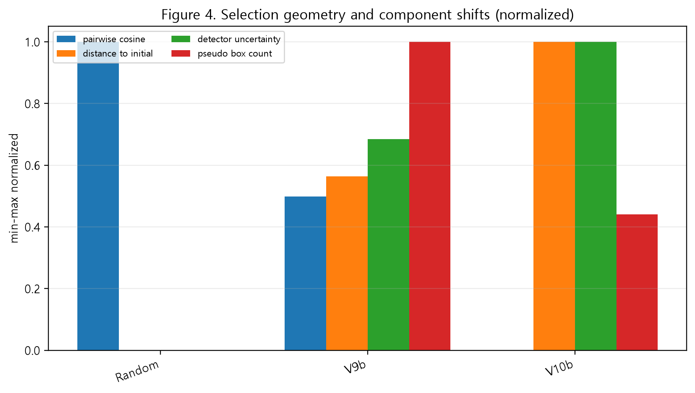

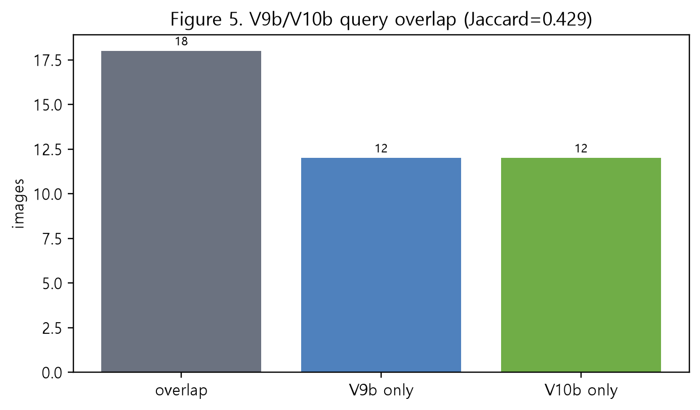

## 6. Detector 성능 결과

| Strategy   |   Budget |    mAP50 |   mAP50-95 |   Precision |   Recall |       F1 |
|:-----------|---------:|---------:|-----------:|------------:|---------:|---------:|
| Round0     |       60 | 0.581204 |   0.306094 |    0.566488 | 0.599504 | 0.582529 |
| Random     |       90 | 0.641054 |   0.3297   |    0.620629 | 0.610587 | 0.615567 |
| V9b        |       90 | 0.623766 |   0.317276 |    0.661013 | 0.579154 | 0.617382 |
| V10b       |       90 | 0.647079 |   0.340866 |    0.64134  | 0.621586 | 0.631309 |

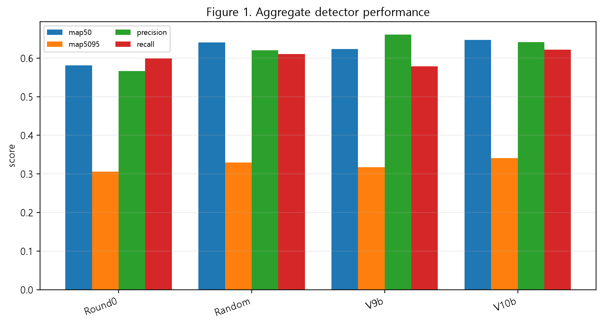

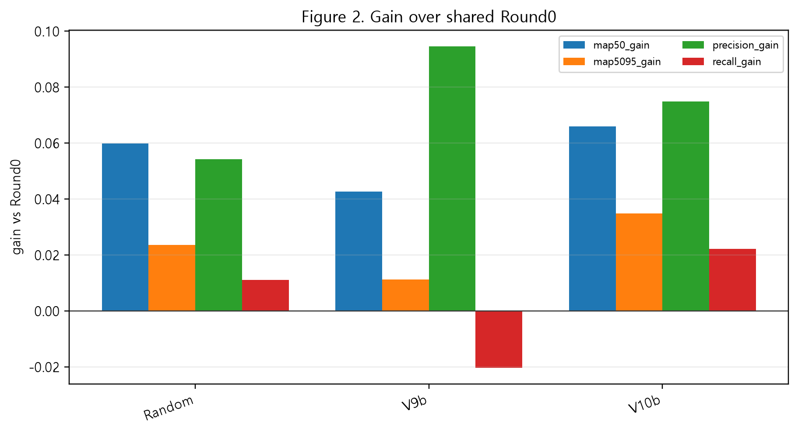

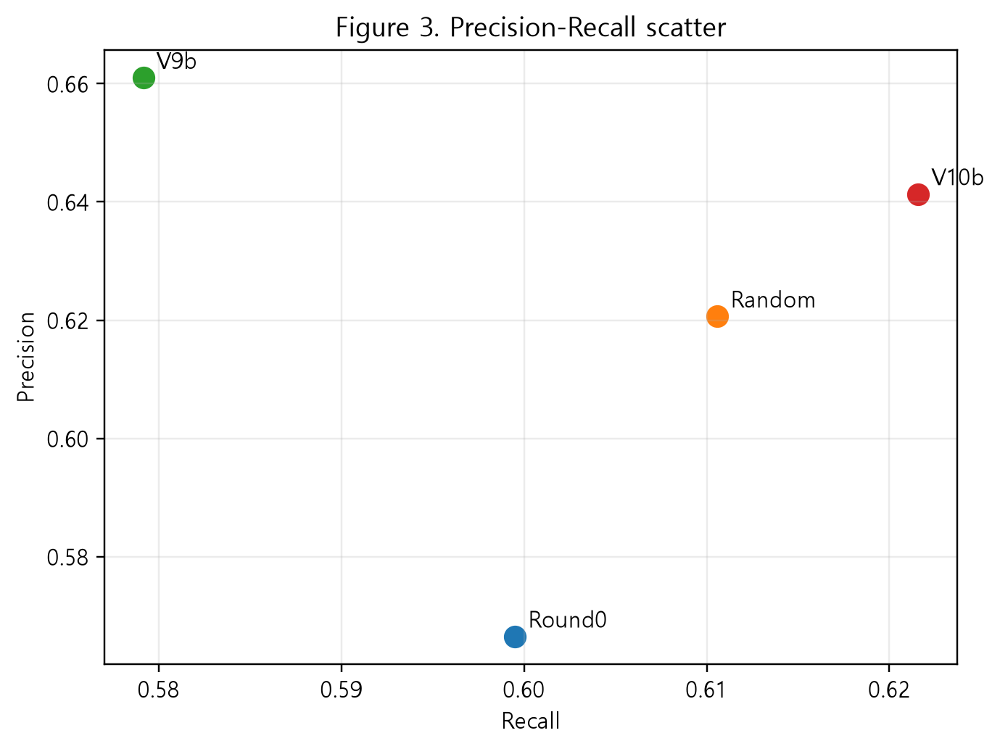

V10b minus Random: mAP50 `0.006025`, mAP50-95 `0.011166`, precision `0.020711`, recall `0.010999`.

V10b minus V9b: mAP50 `0.023313`, mAP50-95 `0.023590`, precision `-0.019673`, recall `0.042432`.

## 7. Per-class AP 분석

V10b는 Random 대비 AP50-95에서 crazing, patches, pitted_surface, scratches에서 이겼고 inclusion, rolled-in_scale에서는 졌다.

| class_name      |   V10b_minus_Random_ap5095 |
|:----------------|---------------------------:|
| crazing         |                     0.0244 |
| inclusion       |                    -0.0596 |
| patches         |                     0.0247 |
| pitted_surface  |                     0.0496 |
| rolled-in_scale |                    -0.0138 |
| scratches       |                     0.0417 |

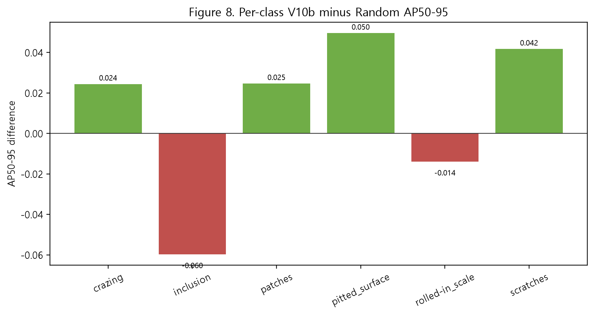

V10b는 V9b 대비 NEU 6개 클래스 모두에서 AP50-95가 높았다.

| class_name      |   V10b_minus_V9b_ap5095 |
|:----------------|------------------------:|
| crazing         |                  0.0103 |
| inclusion       |                  0.0193 |
| patches         |                  0.0302 |
| pitted_surface  |                  0.0055 |
| rolled-in_scale |                  0.0188 |
| scratches       |                  0.0574 |

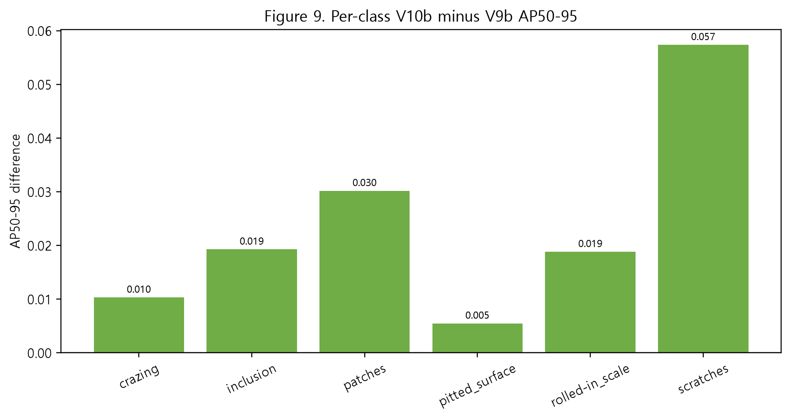

## 8. Annotation Efficiency

| Strategy   |   Total bbox |   Additional bbox |   mAP50-95 gain |   Gain/additional bbox |
|:-----------|-------------:|------------------:|----------------:|-----------------------:|
| Random     |          191 |                52 |        0.023606 |               0.000454 |
| V9b        |          224 |                85 |        0.011182 |               0.000132 |
| V10b       |          206 |                67 |        0.034772 |               0.000519 |

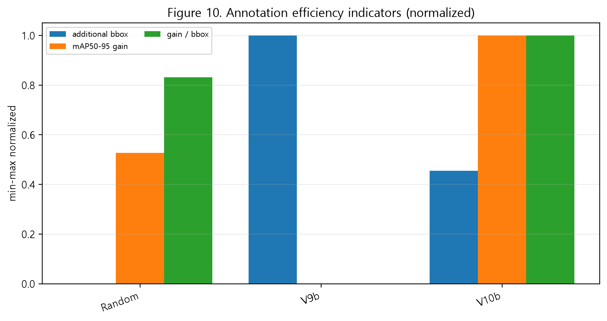

Gain per additional bbox는 annotation time을 직접 측정한 비용 모델이 아니다. 동일 이미지 내 bbox 수가 annotation cost에 미치는 영향을 단순 proxy로 본 보조 지표이며, 단독 성능지표로 사용해서는 안 된다.

## 9. Cumulative labeled set 분석

V10b cumulative 90장의 실제 XML class distribution은 crazing 30, inclusion 34, patches 48, pitted_surface 30, rolled-in_scale 34, scratches 30이며 total bbox는 206, entropy는 2.5620이다. Query batch만 보면 scratches 편향과 patches 부족이 보이지만 initial set과 결합된 cumulative set은 비교적 균형적이다.

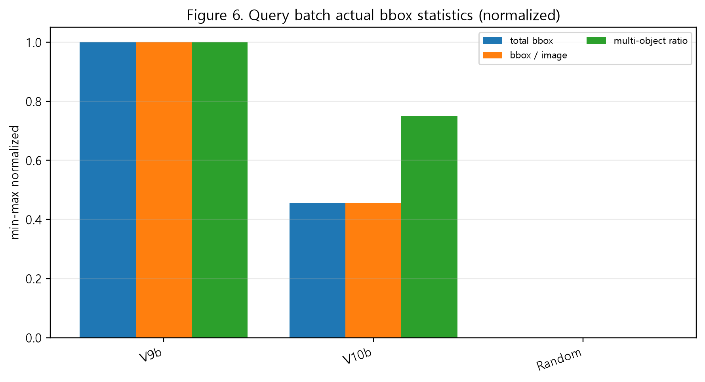

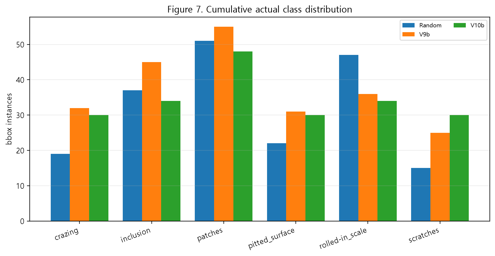

높은 entropy가 성능 향상의 직접 원인이라는 주장은 금지한다. 현재는 class balance가 detector utility와 양립했다는 정도만 말할 수 있다.

## 10. Integrity Audit

독립 감사 결과는 pass with caveat이다. initial size 60, query size 30, cumulative 90, train/dev overlap 0, final test used=False/read=False, V10b training count=1, selection SHA match, acquisition seed 42, training seed 1042, aggregate metric recovery 일치가 확인되었다.

주의점은 git_dirty=True, seed42가 tuning/development seed, single training seed, YAML nc=15 placeholder 문제이다. 본 문서의 per-class 해석은 NEU 6개 클래스만 사용한다.

## 11. 증거 수준 구분

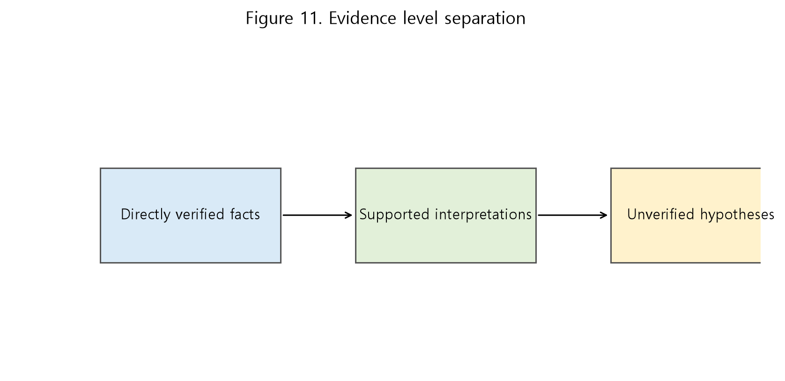

### Directly verified facts

- V10b seed42 mAP50-95=0.340866
- Random seed42 mAP50-95=0.329700
- validation-only recovery가 aggregate 기록과 일치
- final test 미사용
- selection Jaccard=0.428571

### Supported interpretations

- V10b가 V9b의 instance-rich 편향을 완화했다.
- V10b selection은 visual redundancy를 줄였다.
- V10b는 candidate method로서 seed43-46 검증을 수행할 가치가 있다.

### Unverified hypotheses

- uncertainty 증가가 recall 향상의 직접 원인이다.
- DINO diversity 증가가 성능 향상의 직접 원인이다.
- class entropy 증가가 성능 향상의 직접 원인이다.
- V10b가 모든 seed나 final test에서도 Random보다 우수하다.

## 12. 최종 판정과 다음 단계

V10b는 V9b의 instance-rich 편향을 완화하고 uncertainty와 visual diversity를 강화함으로써 recall 저하를 회복했으며, seed42 development one-cycle에서 Random보다 높은 mAP, precision, recall과 더 나은 annotation-efficiency proxy를 달성했다. 다만 seed42는 방법 선택에 사용된 development seed이므로, V10b 가중치를 고정한 뒤 새로운 acquisition seed에서 재현성을 검증해야 한다.

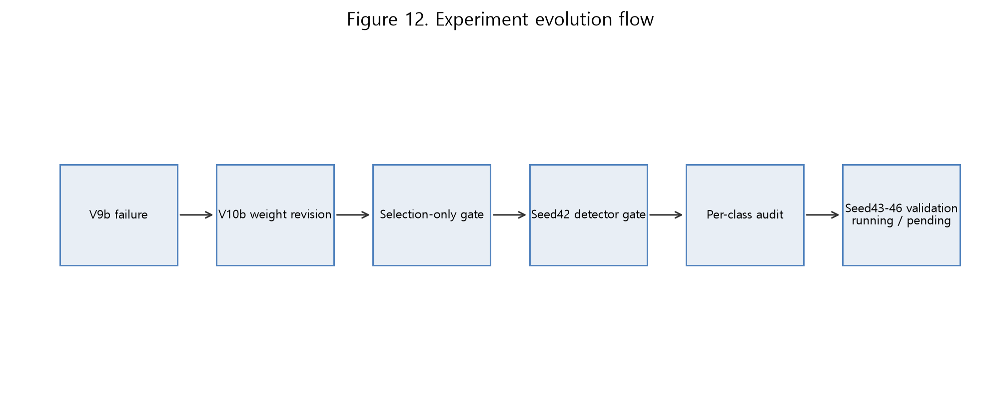

다음 단계는 V10b weights frozen 상태에서 seed43-46 Random vs V10b one-cycle 검증이며, 그 결과가 통과한 뒤 full learning curve와 final test 1회 평가로 진행한다.

> 본 보고서는 acquisition seed 42와 training seed 1042를 사용한 development-stage 결과를 정리한 것이며 독립 multiseed 검증과 locked final-test 평가 이전의 탐색/방법개발 단계 증거이다.
