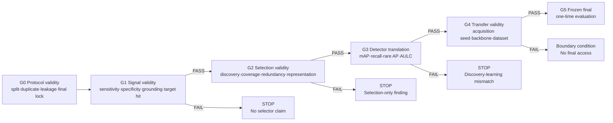

# 산업 결함 GT-free Active Learning의 validity-gated workflow와 detector/backbone capacity 연구 근거

- 작성일: 2026-07-15
- 상태: 기존 개발 결과 통합 / 신규 학습 없음 / final test 미사용
- 권고: **validity-gated workflow를 주 연구로 고정하고, detector/backbone capacity는 AL 가설과 분리된 보조 요인실험으로만 수행한다.**

## 1. 결론부터

현재 증거는 “VLM 기반 GT-free selector가 Random보다 우수하다”는 최초 가설을 지지하지 않는다. 그러나 모든 데이터셋에서 아무 신호도 없었던 것은 아니다. 더 정확한 관찰은 다음과 같다.

1. **균형 잡힌 all-defect pool에서는 Random이 강했다.** NEU의 large-pool protocol에서 새 selector의 이득은 작고 확장되지 않았다.
2. **희소 anomaly 또는 taxonomy discovery에서는 frozen DINO가 매우 강할 수 있었다.** VisA, MPDD, GC10에서 discovery 지표는 Random보다 크게 좋아졌다.
3. **discovery가 detector learning으로 자동 번역되지는 않았다.** GC10에서 전체 mAP는 올랐지만 rare-class AP가 악화되었고, representation audit에서는 특정 클래스의 구조가 복구되지 않았다.
4. **현재 사용 가능한 소형 Qwen VLM의 설명·grounding 신호는 acquisition에 쓰기 전에 붕괴했다.** 모델별로 all-positive, all-negative, schema failure라는 서로 다른 collapse가 관찰되었다.
5. **따라서 연구의 중심 질문은 “어떤 selector가 최고인가?”가 아니라 “어떤 신호가 어떤 조건에서 annotation과 detector 성능으로 번역될 자격이 있는가?”가 되어야 한다.**

이것은 단순한 실패 정리가 아니다. 산업 현장에서 비싼 라벨링과 detector 학습을 시작하기 전에 다음 세 질문을 순차적으로 검증하는 **의사결정 절차**다.

- 신호가 주장하는 의미를 실제로 측정하는가?
- 그 신호가 필요한 표본을 발견하면서 운영 단위의 coverage를 보존하는가?
- 그 선택 이득이 downstream detector와 희소 클래스 성능으로 번역되는가?

## 2. 초기 연구와 현재 연구의 연속성

### 2.1 초기 계획의 강한 주장

초기 학위논문 계획서는 다음을 목표로 했다.

- VLM 설명 Self-Consistency를 언어적 epistemic uncertainty로 해석
- 주석자 합의도와 Pearson rho > 0.6
- Random, Entropy, HDAL-LB 대비 +2~3% mAP
- 언어 정렬 기반 domain adaptation +3~5% mAP
- 라벨링 비용 80% 절감
- 설명을 통해 현장 수용성과 신뢰 향상

현재 결과로는 이 목표들을 성과 주장으로 유지할 수 없다. 특히 사람 대상 실험이 없으므로 신뢰·수용성 향상도 주장할 수 없다.

### 2.2 초기 타당성 문서에 이미 존재한 안전한 축

반면 초기 타당성 연구 문서는 SOTA 자체보다 다음을 우선했다.

- Self-Consistency와 오류의 관계를 먼저 검증
- consistency가 정확성을 보장하지 않는다는 한계 인정
- low/mid/high consistency 응답을 실제 결함 영역과 대조
- signal validation 후 Random·detector baseline과 비교
- 반복 seed와 budget curve로 보고

초기 문헌지도는 현재 관찰된 세 위험을 이미 명시했다.

1. **consistent hallucination:** 높은 일관성이 일관된 오답일 수 있음
2. **cross-model acquisition risk:** VLM selector가 고른 표본이 YOLO learner에 유용하지 않을 수 있음
3. **evaluation instability:** seed, budget, 재학습 조건에 따라 Random 대비 결론이 뒤집힐 수 있음

따라서 현재 전환은 초창기 연구를 버리는 것이 아니라, 그중 입증되지 않은 성능 약속을 제거하고 **타당성 검증이라는 가장 방어 가능한 축을 실험 결과로 완성하는 것**이다.

## 3. 로컬 결과가 만드는 조건별 증거 지도

| 조건 | 비교와 규모 | 핵심 수치 | 냉정한 판정 | workflow에서의 역할 |
|---|---|---:|---|---|
| NEU balanced large-pool | V10c24 vs Random, acquisition seed 47–50 | mAP50-95 +0.001542, recall +0.011695 | 제한적 후보였으나 실질적 우위 아님 | Random 강세 조건 |
| NEU round-2 scale | seed 51, budget 120 | mAP50-95 -0.004863, gate 0/1 | 확장 실패 | 작은 초기 차이를 일반화하면 안 됨 |
| NEU seed45 고정 세트 | 5 training seeds | Visual20 mAP +0.016236, CI [0.006738, 0.027864], 5/5 wins | 해당 acquisition set의 training 안정성만 확인 | training stochasticity gate 필요 |
| NEU 독립 acquisition 확인 | 10 acquisition seeds | mAP +0.007019, descriptive CI [-0.005211, 0.019678], p=0.322266, 7/10 wins | 재현 실패 | acquisition-seed 일반화 gate 필요 |
| VisA anomaly-sparse pool | 200 seeds, initial/query 20/20 | anomaly +14.480/20, first anomaly -6.935, category coverage -4.110 | 강한 anomaly discovery, 심각한 category collapse | discovery와 coverage 분리 |
| MPDD heterogeneous pool | 200 seeds | anomaly +6.245, CI [5.885, 6.605], category coverage -0.325 | discovery 강함, coverage gate 실패; source-origin confound | domain/source discovery 감시 |
| GC10 taxonomy discovery | 200 seeds | combined classes +0.825, rare images +2.720, rare classes +1.210, first rare -5.440 | selection-only gate 통과 | detector 확인을 정당하게 승인한 사례 |
| GC10 detector translation | 5 acquisition × 3 training seeds | mAP +0.017378, CI [0.000580, 0.036332], recall +0.035381 | aggregate 성능은 실제 개선 | 긍정 성능 증거가 존재함 |
| GC10 rare-class detector | 동일 30 models | rare macro AP -0.019877; class 9 -0.031907; class 10 -0.028495 | 사전 gate 실패 | aggregate mAP가 희소 결함 실패를 숨김 |
| GC10 DINO prototype reuse | 5 acquisition seeds | query overlap 10.0/20 vs Random 0.4/20 | seed가 달라도 같은 prototype 반복 | 유효 acquisition 독립성 저하 |
| GC10 D2R | 200 seeds | discovery gain 유지, target-hit 0.299, top-10 concentration ratio 0.800625 | representation gate 실패 | 발견과 표현 적합성 분리 |
| GC10 class-8 retrieval | 1,000 frozen replay rounds | best hit 0.1538, complete recovery gate 0개 | representation branch 종료 | post-hoc rescue 중단 기준 |
| GC10 paired VLM gate | Qwen2-VL-2B, Qwen3-VL-2B, Qwen2.5-VL-3B | balanced accuracy 0.50/0.55/0.70; median positive bbox IoU 0.1617/0/0 | 3개 모델 모두 FAIL | 설명 일관성 전에 detection·grounding validity 필요 |

### 3.1 이 결과에서 실제로 얻은 양의 성능 증거

“성능이 오른 것이 하나도 없다”는 해석은 사실과 다르다. GC10 개발 조건에서 frozen DINO는 Random 대비 다음을 보였다.

- mAP50-95: 0.124235 → 0.141614, **+0.017378**
- 상대적 mAP 증가: 약 **14.0%**
- recall: 0.316877 → 0.352259, **+0.035381**
- acquisition-seed 평균 기준 4/5 wins
- frequent-class macro AP: **+0.033345**

이 효과는 “GT-free visual discovery가 detector에 전혀 도움이 되지 않는다”는 귀무적 서사를 반박한다. 동시에 rare macro AP -0.019877은 “전체 mAP가 올랐으므로 annotation triage가 성공했다”는 결론도 막는다. 바로 이 양면성이 validity gate가 필요한 가장 강한 수치적 사례다.

### 3.2 데이터셋 전체를 관통하는 경계 조건

| pool 구조 | 관찰된 최선 해석 | 예상되는 실패 |
|---|---|---|
| class-balanced, all-defect, 충분히 큰 pool | Random 자체가 class·instance diversity를 확보 | 복잡한 selector 이득이 작고 불안정 |
| anomaly-sparse, normal-dominated pool | 초기 집합에서 먼 frozen visual feature가 anomaly triage에 유용 | 특정 product/domain/outlier에 집중 |
| all-defect, long-tail taxonomy pool | visual diversity가 rare taxonomy 발견을 앞당길 수 있음 | within-class 대표성 및 downstream rare AP 불일치 |
| VLM이 결함을 안정적으로 인식하지 못하는 pool | explanation consistency는 측정 이전에 의미 기반이 붕괴 | 일관된 환각, 응답 편향, grounding 부재 |

이것이 논문의 핵심 산출물인 **조건 지도(condition map)** 다. “Random이 항상 최고”도 아니고 “DINO가 항상 좋다”도 아니다.

## 4. 선행연구가 validity-gated workflow를 지지하는 이유

### 4.1 Random은 형식적 baseline이 아니라 강한 경쟁자다

[Munjal et al., CVPR 2022](https://openaccess.thecvf.com/content/CVPR2022/html/Munjal_Towards_Robust_and_Reproducible_Active_Learning_Using_Neural_Networks_CVPR_2022_paper.html)는 동일한 학습 조건과 강한 정규화를 적용하면 여러 uncertainty, diversity, committee AL 방법의 Random 대비 우위가 일관되지 않거나 매우 작아질 수 있음을 보였다. [Cawley, AISTATS 2011](https://proceedings.mlr.press/v16/cawley11a.html)도 Random이 복잡한 전략과 경쟁적일 수 있음을 보고했다.

따라서 본 연구가 Random의 class coverage, bbox richness, instance diversity를 실제로 감사한 것은 사후 변명이 아니라 AL 재현성 문헌이 요구하는 정상적인 절차다.

### 4.2 acquisition signal은 learner와 독립적인 보편 진리가 아니다

[Lowell et al., EMNLP-IJCNLP 2019](https://aclanthology.org/D19-1003/)는 한 모델로 능동 취득한 데이터가 다른 successor model에서 일관되게 이득을 유지하지 않는 practical obstacle을 보였다. 이는 VLM/DINO selector와 YOLO learner가 다른 현재 구조에 직접 적용된다.

GC10에서 DINO가 rare image를 더 많이 선택하고도 rare detector AP를 악화시킨 것은 이 문헌의 산업 결함 detection 사례에 해당한다. 따라서 detector/backbone 변경은 selector 성능 향상의 일부로 조용히 섞을 수 없고, 반드시 별도 요인으로 실험해야 한다.

### 4.3 VLM self-consistency는 visual groundedness와 동일하지 않다

[SelfCheckGPT](https://aclanthology.org/2023.emnlp-main.557/)와 [semantic entropy 연구](https://www.nature.com/articles/s41586-024-07421-0)는 다중 생성의 일관성·의미적 불확실성이 언어 모델의 confabulation 탐지에 유용할 수 있음을 보였다. 그러나 이는 산업 이미지의 결함 존재와 bbox grounding을 보장하지 않는다. [POPE](https://aclanthology.org/2023.emnlp-main.20/) 역시 VLM의 object hallucination을 별도로 평가해야 함을 보여준다.

따라서 다음 함의가 성립한다.

> explanation consistency를 acquisition uncertainty로 쓰기 전에, 결함 존재 민감도·배경 특이도·grounding IoU를 통과해야 한다.

현재 paired Qwen 결과는 이 선행 조건을 통과하지 못했다. 이것은 “프롬프트를 더 바꾸면 될 것”이라는 무한 반복을 막는 유효한 중단 증거다.

### 4.4 detection에서 성공한 consistency는 learner-coupled signal이다

[CALD, CVPRW 2022](https://openaccess.thecvf.com/content/CVPR2022W/L3D-IVU/html/Yu_Consistency-Based_Active_Learning_for_Object_Detection_CVPRW_2022_paper.html)는 원본과 변형 이미지 사이 detector의 class·localization consistency를 acquisition에 이용하여 VOC/COCO에서 Random 대비 개선을 보고했다. 이 신호는 학습할 detector의 출력과 직접 결합되어 있다.

따라서 CALD의 성공은 VLM textual consistency의 성공을 보장하지 않는다. 오히려 현재 결과는 다음을 구분해야 한다는 근거다.

- **learner-coupled uncertainty:** detector가 무엇을 어려워하는지 측정
- **learner-agnostic discovery:** frozen representation에서 멀거나 다양한 표본을 발견
- **linguistic consistency:** 생성 응답의 변동성을 측정

세 신호는 같은 의미가 아니며, 각기 다른 validity gate가 필요하다.

### 4.5 cold-start에서는 outlier보다 density/coverage가 중요할 수 있다

[Active Learning Through a Covering Lens, NeurIPS 2022](https://proceedings.neurips.cc/paper_files/paper/2022/file/8c64bc3f7796d31caa7c3e6b969bf7da-Paper-Conference.pdf)는 저예산 cold-start에서 pool coverage와 density가 중요하며, farthest-first류 방법이 outlier를 고를 수 있음을 지적한다. VisA의 `pipe_fryum` 집중, MPDD의 source-origin confound, GC10의 repeated prototype은 이론적 위험의 구체적 산업 사례다.

### 4.6 산업 AL도 hybrid·조건부 전략을 사용한다

[industrial defect hybrid AL 연구](https://link.springer.com/article/10.1007/s00170-025-17378-7)는 reflective machined aluminum porosity 조건에서 entropy, 물리적 contextual class, Random을 결합하고 반복 실험으로 평가했다. 이는 산업 AL이 하나의 보편 selector보다 공정 구조와 model uncertainty를 함께 반영해야 함을 지지한다.

[Safaei and Patel, WACV 2025](https://openaccess.thecvf.com/content/WACV2025/html/Safaei_Active_Learning_for_Vision_Language_Models_WACV_2025_paper.html)의 VLM AL도 calibrated entropy, self/neighbor uncertainty, clustering을 사용한 image classification 방법이다. 이 논문을 산업 defect object detection의 generative explanation-grounding 유효성 근거로 과장하면 안 된다.

### 4.7 gate와 final lock은 통계적 장식이 아니다

[Dwork et al.의 reusable holdout 연구](https://pubmed.ncbi.nlm.nih.gov/26250683/)는 반복적인 adaptive analysis가 holdout의 통계적 유효성을 훼손할 수 있음을 보였다. [Kapoor and Narayanan의 leakage 연구](https://pmc.ncbi.nlm.nih.gov/articles/10499856/)도 ML 연구에서 leakage가 광범위한 문제임을 문서화한다.

본 연구의 frozen threshold, post-hoc 표시, final hash lock은 “엄격해 보이기 위한 형식”이 아니라 작은 산업 데이터에서 반복 시도에 의한 자기기만을 막는 핵심 방법론이다.

## 5. 제안하는 validity-gated workflow

### G0. Protocol validity

- duplicate-safe split과 SHA/path audit
- selector에서 폴더명, 파일명, XML, split-origin 숨김
- development/final 역할 고정
- final hash 봉인과 접근 로그
- post-hoc GT audit의 역할 명시

### G1. Signal validity

- VLM: positive sensitivity, background specificity, balanced accuracy, bbox coverage, IoU
- representation retrieval: target hit, candidate purity, class-wise failure
- detector uncertainty: calibration 또는 error association

G1을 통과하지 못한 신호는 consistency나 fusion weight를 조정하지 않는다.

### G2. Selection validity

- discovery: anomaly yield, unique/rare class discovery, annotations-to-first-target
- safety: product/category coverage non-inferiority, instance yield
- redundancy: query pairwise similarity, initial-set distance, cross-seed overlap
- representation: within-class diversity, target-class neighborhood purity

G2 통과는 detector 성능을 입증하는 것이 아니라, 개발용 detector 확인을 **허가**할 뿐이다.

### G3. Detector translation

- aggregate mAP50-95와 recall
- frequent/rare macro AP와 per-class AP
- acquisition seed를 추론 단위로 사용
- training seed는 각 acquisition set의 잡음을 평균내는 nested repeat로 사용
- 여러 budget이 있으면 endpoint뿐 아니라 AULC 보고

### G4. Transfer validity

- 독립 acquisition seeds
- 다른 learner capacity/backbone
- 가능하면 독립 산업 dataset
- selector threshold와 gate를 결과 확인 후 변경하지 않음

### G5. Final

- 모든 가설, 코드, checkpoint rule, 통계 분석을 동결한 뒤 한 번만 사용
- final은 selector 개발이나 backbone 선택에 사용하지 않음

## 6. 새 논문의 연구 질문과 가설

### RQ1. 어떤 pool 조건에서 Random이 이미 강한가?

가설 H1: class-balanced all-defect pool에서는 Random이 높은 class coverage와 instance diversity를 자연스럽게 확보하여, learner-agnostic diversity selector의 detector 이득이 작아진다.

### RQ2. label-free 신호는 자신이 주장하는 의미를 실제로 측정하는가?

가설 H2a: generative VLM consistency는 detection·grounding validity 없이 defect uncertainty로 해석할 수 없다.

가설 H2b: frozen visual distance는 anomaly/taxonomy discovery에는 유효할 수 있으나 defect-specificity와 source/category confound를 별도로 감사해야 한다.

### RQ3. selection-only 이득은 downstream detector로 언제 번역되는가?

가설 H3: class discovery 수만으로는 충분하지 않으며, within-class 대표성, bbox geometry, cross-seed prototype 다양성이 보존될 때 detector 이득으로 번역된다.

### RQ4. aggregate mAP는 산업 안전 관점의 실패를 숨기는가?

가설 H4: aggregate mAP 개선과 rare-class AP 개선은 독립적일 수 있으므로, rare macro/per-class gate가 없는 AL 평가는 불충분하다.

### RQ5. learner capacity는 selector utility를 바꾸는가?

이 질문은 선택적으로 수행하되, **주 validity 논문의 보조 연구**로 둔다. detector가 커져서 모두의 AP가 오르는 main effect와 DINO가 Random보다 더 유용해지는 interaction을 구분해야 한다.

## 7. detector/backbone capacity 실험을 분리해야 하는 논리

### 7.1 혼합하면 안 되는 이유

selector를 바꾸면서 YOLO 세대·architecture·capacity까지 함께 바꾸면 다음 세 원인이 분리되지 않는다.

- 더 좋은 이미지를 선택했기 때문
- 더 큰 learner가 소량 데이터에서 더 잘 학습했기 때문
- architecture/optimization recipe가 달라졌기 때문

따라서 “YOLO 모델을 바꿔 selector를 살린다”는 서사는 연구적으로 약하다. 대신 다음 질문으로 바꾼다.

> 동일한 frozen acquisition set에 대해 learner capacity가 Random–DINO 성능 차이와 rare-class translation failure를 바꾸는가?

### 7.2 권고 요인실험

| 요인 | 수준 |
|---|---|
| selector | GTFreeRandom, FrozenDINOVisualDiversity |
| learner capacity | 기존 YOLOv8n, 신규 YOLOv8s |
| acquisition seed | 기존 GC10 5개 |
| training seed | 각 set당 3개 |
| labeled set | 기존 frozen 40장 그대로 |
| evaluation | development only |
| final | locked |

기존 YOLOv8n 30개 결과를 재사용하고, YOLOv8s만 2 × 5 × 3 = **30개 신규 모델**을 학습한다. 새로운 selection이나 annotation은 하지 않는다.

`YOLO26n`처럼 세대와 구조가 다른 모델은 첫 capacity 실험에 쓰지 않는다. `v8n → v8s`처럼 같은 family에서 scale만 바꾸어야 capacity 해석이 상대적으로 깨끗하다.

### 7.3 1차 추정량

주 추정량은 단순한 v8s 최고 mAP가 아니라 difference-in-differences다.

\[
\Delta_{interaction}=
[(mAP_{DINO}-mAP_{Random})_{v8s}]
-[(mAP_{DINO}-mAP_{Random})_{v8n}]
\]

같은 식을 rare macro AP에도 적용한다. acquisition seed별로 3개 training seed를 먼저 평균한 뒤, 5개 acquisition seed의 paired difference를 분석한다. 15개 학습 run을 독립 표본처럼 취급하면 pseudo-replication이다.

### 7.4 사전 판정 기준

capacity 실험은 다음을 모두 분리해 보고한다.

1. **backbone main effect:** v8s가 Random과 DINO 모두를 얼마나 올리는가
2. **selector portability:** v8s에서도 DINO-Random mAP ≥ +0.010, 4/5 acquisition wins, paired bootstrap CI lower > 0
3. **rare repair:** v8s에서 DINO-Random rare macro AP ≥ 0이고, v8n 대비 interaction ≥ +0.015
4. **safety:** frequent macro AP와 recall이 Random 대비 -0.020보다 나쁘지 않음

현재 acquisition seed가 5개뿐이므로 이 실험은 development-stage exploratory confirmation이다. CI와 sign-flip 결과를 보고하되 높은 검정력을 주장하지 않는다.

### 7.5 해석표

| 관찰 | 해석 | 다음 결정 |
|---|---|---|
| v8s가 두 selector를 비슷하게 향상, DINO rare deficit 유지 | detector capacity main effect만 존재 | AL과 분리된 detector 결과; selector 성공 아님 |
| DINO-Random 차이가 v8s에서 사라짐/역전 | acquisition utility가 learner-coupled | 보편 selector 주장 종료 |
| aggregate DINO 이득 유지, rare deficit 유지 | discovery는 frequent AP로만 번역 | rare-safe triage 실패 유지 |
| DINO 이득과 rare AP가 함께 회복 | capacity-dependent translation 가능성 | 독립 dataset/backbone 확인을 새로 사전 등록 |
| seed별 부호가 크게 흔들림 | acquisition instability | final 접근 없이 종료 |

## 8. 논문에서 주장할 수 있는 것과 없는 것

### 주장 가능한 것

- Random은 NEU balanced large-pool에서 약한 baseline이 아니었다.
- frozen DINO visual distance는 VisA, MPDD, GC10의 특정 cold-start discovery 지표를 크게 개선했다.
- discovery·coverage·representation·detector learning은 서로 다른 단계이며 한 단계의 성공이 다음 단계를 보장하지 않았다.
- GC10에서 aggregate mAP +0.017378과 rare macro AP -0.019877이 동시에 발생했다.
- 테스트한 소형 Qwen VLM들은 paired detection/grounding validity gate를 통과하지 못했다.
- frozen gate는 무의미한 detector 확대와 final-test 접근을 중단하는 재현 가능한 결정 규칙으로 작동했다.

### 주장하면 안 되는 것

- VLM explanation consistency가 유효한 epistemic uncertainty다.
- 새 GT-free selector가 Random보다 보편적으로 우수하다.
- 라벨 비용을 80% 절감했다.
- 현장 검사원의 신뢰나 수용성을 높였다.
- DINO가 defect-specific anomaly를 인식했다.
- 현재 결과가 모든 backbone과 산업 데이터셋에 일반화된다.
- gate가 detector compute를 대규모로 절감했다. 현재 작은 GC10 run 기준 차단한 15개 모델은 약 0.336 GPU-hour 수준이므로, 주 가치는 compute 절감보다 **잘못된 추론과 final 소모 방지**다.

## 9. 산업인공지능 분야에서의 실질적 가치

### 9.1 annotation 투자 전 위험 판별

산업 데이터는 class imbalance, 제품군, 촬영 세션, 설비 상태가 섞여 있다. 단순한 visual novelty가 결함이 아니라 제품 또는 조명 변화를 고를 수 있다. workflow는 수십·수백 장의 post-hoc audit으로 이 위험을 먼저 판별한다.

### 9.2 희소 결함을 aggregate metric 뒤에 숨기지 않음

GC10 사례는 전체 mAP가 약 14% 상대 향상되어도 rare macro AP가 악화될 수 있음을 보여준다. 실제 품질검사에서는 흔한 결함의 평균 성능보다 놓치면 비싼 희소 결함이 더 중요할 수 있다. rare-class gate는 이 운영 위험을 직접 반영한다.

### 9.3 “데이터를 더 모을지, 모델을 키울지”를 분리

selection 실패와 learner capacity 부족을 구분하면 현장은 annotation budget과 compute budget 중 어디에 투자할지 판단할 수 있다. 이것이 backbone capacity 보조 실험의 실무적 의미다.

### 9.4 실패를 재사용 가능한 규칙으로 전환

“이 방법은 안 됐다”로 끝내지 않고, 어떤 지표가 어느 gate에서 왜 실패했는지 보존한다. 다음 dataset에서는 selector를 처음부터 새로 발명하지 않고 같은 audit을 적용하여 진행/중단을 결정할 수 있다.

## 10. 논문 포지셔닝

### 권고 제목

**Before You Train: A Validity-Gated Workflow for GT-Free Active Learning Signals in Industrial Defect Detection**

한국어:

**산업 결함 검출에서 GT-free 능동학습 신호의 학습 전 타당성 검증: Random 강세, discovery–learning 불일치 및 중단 기준에 관한 다중 데이터셋 연구**

### 중심 기여

1. GT-free AL signal을 protocol, semantic, selection, detector translation, transfer의 5단계로 분해한 평가 workflow
2. NEU, VisA, MPDD, GC10에 걸친 Random 강세와 frozen visual discovery의 조건 지도
3. GC10의 양의 aggregate mAP와 음의 rare-class AP를 함께 보인 discovery–learning mismatch 사례
4. VLM consistent hallucination과 DINO prototype concentration을 학습 전에 판별하는 frozen gates
5. final-test를 소비하지 않고 진행/중단을 결정하는 재현 가능한 연구 운영 방식

### 예상 심사 질문과 답

**Q. 결국 새 알고리즘이 없는 것 아닌가?**  
A. 기여는 selector 알고리즘이 아니라, label-free acquisition signal이 detector 실험에 들어갈 자격을 검증하는 방법론과 다중 데이터셋 empirical boundary다. AL 재현성, cross-model transfer, VLM hallucination 문헌이 각각 따로 다룬 위험을 산업 defect pipeline에서 연결한다.

**Q. gate가 성능을 올리는가?**  
A. gate 자체가 mAP optimizer라는 주장을 하지 않는다. GC10에서는 selection gate를 통과한 DINO가 실제 aggregate mAP +0.017378을 냈고, detector gate는 rare AP 악화를 발견하여 final 진입을 막았다. workflow의 효과는 “좋은 후보를 통과시키고 위험한 결론을 차단하는 decision quality”다.

**Q. 전부 negative result 아닌가?**  
A. 아니다. VisA/MPDD/GC10에서 discovery 효과는 크고, GC10 aggregate detector 효과도 양수다. 연구의 핵심은 positive discovery와 negative translation이 동시에 성립하는 조건을 보여주는 것이다.

**Q. 일반화가 충분한가?**  
A. 현재 네 데이터셋은 조건 지도를 만들기에는 의미가 있지만, workflow의 prospective generality를 강하게 주장하려면 frozen workflow를 새로운 dataset 하나에 결과를 보지 않고 적용하는 독립 확인이 필요하다.

## 11. 권고 실행 순서

### 주 경로: 먼저 논문 토대를 고정

1. 모든 run을 하나의 master evidence table로 통합
2. 각 gate의 입력, threshold, 판정, final 사용 여부를 machine-readable CSV로 생성
3. dataset별 `pool condition → signal behavior → gate outcome → detector outcome` 도식 작성
4. 최초 가설, 수정 가설, 폐기한 주장, post-hoc 분석을 구분한 연구 연대기 작성
5. 위 RQ/Hypothesis로 논문 introduction과 methods 초안 작성

### 선택 경로: backbone capacity 보조 실험

문서와 분석 코드·threshold를 먼저 동결한 뒤에만 수행한다. 기존 GC10 frozen sets와 v8n 결과를 재사용하고 v8s 30개만 추가한다. 이 실험은 validity workflow의 성립 여부를 좌우하지 않으며, `learner capacity × selector` interaction을 설명하는 별도 결과다.

### 제출 전 가장 가치 있는 추가 확인

새 selector를 만들기보다, 아직 튜닝하지 않은 독립 산업 dataset 하나에 **동일한 frozen workflow**를 prospective하게 적용한다. 결과가 PASS든 STOP이든 workflow의 사전 의사결정 타당성을 검증한다. final은 workflow와 가설이 완전히 동결될 때까지 열지 않는다.

## 12. 최종 연구 결정

현 상태에서 가장 정직하고 강한 주장은 다음과 같다.

> 산업 결함 GT-free Active Learning에서는 label-free discovery 신호의 존재만으로 detector 학습을 정당화할 수 없다. Random의 구조적 강도, 신호의 semantic/grounding validity, 운영 단위 coverage, within-class representation, rare-class detector translation을 순차적으로 검증해야 한다. 본 연구는 네 산업 데이터 조건에서 이 단계들이 서로 분리됨을 보이고, 학습과 final 평가 전에 진행·중단을 결정하는 validity-gated workflow를 제시한다.

backbone capacity 실험은 이 주장을 대체하지 않는다. 수행한다면 다음의 별도 질문만 검증한다.

> GC10에서 관찰된 DINO의 aggregate 이득과 rare-class 실패는 selector composition의 문제인가, learner capacity와의 상호작용인가?

이 분리가 유지될 때, 현재 연구는 “실패한 selector의 기록”이 아니라 **산업 AL 신호를 배포·학습 전에 검증하는 재현 가능한 의사결정 연구**가 된다.

## 13. 근거 파일

- `runs/random_baseline_audit_v10c24/random_baseline_audit_20260713_225216/random_baseline_audit_summary.md`
- `runs/active_learning_v10c24_round2_scale_smoke/v10c24_round2_scale_smoke_20260713_225326/recovered_v10c24_round2_scale_smoke_summary.md`
- `runs/seed45_fixed_set_stability/seed45_fixed_set_stability_main/seed45_fixed_set_stability_summary.md`
- `runs/active_learning_v8_cold_start_confirmation/v8_cold_start_visual_confirm_main/v8_cold_start_visual_confirmation_analysis.md`
- `docs/visa_selection_only_decision_20260715.md`
- `docs/mpdd_selection_only_decision_20260715.md`
- `runs/gc10_taxonomy_selection_audit/gc10_random_vs_dino_200seed_20260715/gc10_taxonomy_selection_audit_summary.md`
- `runs/gc10_detector_confirmation/gc10_dev_confirm_5acq_3train_20260715/gc10_detector_confirmation_summary.md`
- `runs/gc10_detector_confirmation/gc10_dev_confirm_5acq_3train_20260715/gc10_detector_translation_failure_audit.md`
- `runs/vlm_consistency_groundedness_validity/paired_model_comparison_gc10_20260715/comparison/paired_model_gate_comparison_summary.md`
- `runs/gc10_discovery_representation_audit/gc10_d2r_200seed_20260715/gc10_d2r_selection_summary.md`
- `runs/gc10_discovery_representation_audit/gc10_d2r_200seed_20260715/label_aware_retrieval_audit/label_aware_retrieval_summary.md`
- `docs/gc10_d2r_representation_branch_closure_20260715.md`

초기 방향 대조 자료:

- `Active Learning의발전과 VLM 결합 연구 동향_이호열.pdf`
- `발표_대본__Active_Learning의_발전과_VLM_결합_연구_동향.pdf`
- `474aae46-65df-4446-bb82-de5f46bfe19b__학위논문_연구계획서_(전체_문서).pdf`
- `ae434082-0e63-4b21-aba7-0e623431e317_VLM_설명_일관성Groundedness산업_결함_객체탐지_Active_Learning_문헌지도.pdf`
- `4d8e6f7e-b94d-41b7-a14d-5f8ecfda569f_VLM_Self-Consistency_기반_설명_가능한_능동_학습_제조_현장_수용성_향상을_위한_타당성_연구.pdf`
